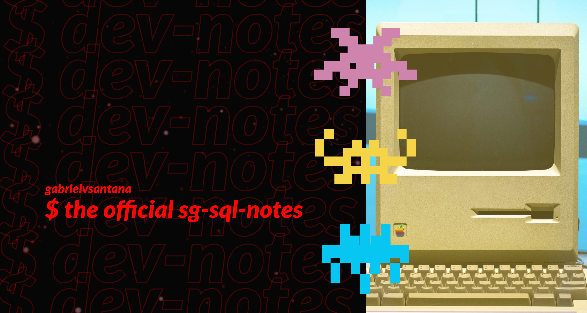

# SQL and PostgreSQL: The Complete Developer's Guide - Stephen Grider

 

https://www.udemy.com/course/sql-and-postgresql/

# Table of Contents

1. [Section 1: Simple - But Powerful - SQL Statements](sections/01)
1. [Section 2: Filtering Records](sections/02)
1. [Section 3: Working with Tables](sections/03)
1. [Section 4: Relating Records with Joins](sections/04)
1. [Section 5: Aggregation of Records](sections/05)
1. [Section 6: Working with Large Datasets](sections/06)
1. [Section 7: Sorting Records](sections/07)
1. [Section 8: Unions and Intersections with Sets](sections/08)
1. [Section 9: Assembling Queries with SubQueries](sections/09)
1. [Section 10: Selecting Distinct Records](sections/10)
1. [Section 11: Utility Operators, Keywords, and Functions](sections/11)
1. [Section 12: Local PostgreSQL Installation](sections/12)
1. [Section 13: PostgreSQL Complex Datatypes](sections/13)
1. [Section 14: Database-Side Validation and Constraints](sections/14)
1. [Section 15: Database Structure Design Patterns](sections/15)
1. [Section 16: How to Build a 'Like' System](sections/16)
1. [Section 17: How to Build a 'Mention' System](sections/17)
1. [Section 18: How to Build a 'Hashtag' System](sections/18)
1. [Section 19: How to Design a 'Follower' System](sections/19)
1. [Section 20: Implementing Database Design Patterns](sections/20)
1. [Section 21: Approaching and Writing Complex Queries](sections/21)
1. [Section 22: Understanding the Internals of PostgreSQL](sections/22)
1. [Section 23: A Look at Indexes for Performance](sections/23)
1. [Section 24: Basic Query Tuning](sections/24)
1. [Section 25: Advanced Query Tuning](sections/25)
1. [Section 26: Simple Common Table Expressions](sections/26)
1. [Section 27: Recursive Common Table Expressions](sections/27)
1. [Section 28: Simplifying Queries with Views](sections/28)
1. [Section 29: Optimizing Queries with Materialized Views](sections/29)
1. [Section 30: Handling Concurrency and Reversibility with Transactions](sections/30)
1. [Section 31: Managing Database Design with Schema Migrations](sections/31)
1. [Section 32: Schema vs Data Migrations](sections/32)
1. [Section 33: Accessing PostgreSQL From API's](sections/33)
1. [Section 34: Data Access Pattern - Repositories](sections/34)
1. [Section 35: Security Around PostgreSQL](sections/35)
1. [Section 36: Fast Parallel Testing](sections/36)
1. [Left Over]()
