# SQL and PostgreSQL: The Complete Developer's Guide - Stephen Grider
https://www.udemy.com/course/sql-and-postgresql/

# Table of Contents

1. [Section 1: Simple - But Powerful - SQL Statements](#section-1-simple---but-powerful---sql-statements)
1. [Section 2: Filtering Records](#section-2-filtering-records)
1. [Section 3: Working with Tables](#section-3-working-with-tables)
1. [Section 4: Relating Records with Joins](#section-4-relating-records-with-joins)
1. [Section 5: Aggregation of Records](#section-5-aggregation-of-records)
1. [Section 6: Working with Large Datasets](#section-6-working-with-large-datasets)
1. [Section 7: Sorting Records](#section-7-sorting-records)
1. [Section 8: Unions and Intersections with Sets](#section-8-unions-and-intersections-with-sets)
1. [Section 9: Assembling Queries with SubQueries](#section-9-assembling-queries-with-subqueries)
1. [Section 10: Selecting Distinct Records](#section-10-selecting-distinct-records)
1. [Section 11: Utility Operators, Keywords, and Functions](#section-11-utility-operators-keywords-and-functions)
1. [Section 12: Local PostgreSQL Installation](#section-12-local-postgresql-installation)
1. [Section 13: PostgreSQL Complex Datatypes](#section-13-postgresql-complex-datatypes)
1. [Section 14: Database-Side Validation and Constraints](#section-14-database-side-validation-and-constraints)
1. [Section 15: Database Structure Design Patterns](#section-15-database-structure-design-patterns)
1. [Section 16: How to Build a 'Like' System](#section-16-how-to-build-a-like-system)
1. [Section 17: How to Build a 'Mention' System](#section-17-how-to-build-a-mention-system)
1. [Section 18: How to Build a 'Hashtag' System](#section-18-how-to-build-a-hashtag-system)
1. [Section 19: How to Design a 'Follower' System](#section-19-how-to-design-a-follower-system)
1. [Section 20: Implementing Database Design Patterns](#section-20-implementing-database-design-patterns)
1. [Section 21: Approaching and Writing Complex Queries](#section-21-approaching-and-writing-complex-queries)
1. [Section 22: Understanding the Internals of PostgreSQL](#section-22-understanding-the-internals-of-postgresql)
1. [Section 23: A Look at Indexes for Performance](#section-23-a-look-at-indexes-for-performance)
1. [Section 24: Basic Query Tuning](#section-24-basic-query-tuning)
1. [Section 25: Advanced Query Tuning](#section-25-advanced-query-tuning)
1. [Section 26: Simple Common Table Expressions](#section-26-simple-common-table-expressions)
1. [Section 27: Recursive Common Table Expressions](#section-27-recursive-common-table-expressions)
1. [Section 28: Simplifying Queries with Views](#section-28-simplifying-queries-with-views)
1. [Section 29: Optimizing Queries with Materialized Views](#section-29-optimizing-queries-with-materialized-views)
1. [Section 30: Handling Concurrency and Reversibility with Transactions](#section-30-handling-concurrency-and-reversibility-with-transactions)
1. [Section 31: Managing Database Design with Schema Migrations](#section-31-managing-database-design-with-schema-migrations)
1. [Section 32: Schema vs Data Migrations](#section-32-schema-vs-data-migrations)
1. [Section 33: Accessing PostgreSQL From API's](#section-33-accessing-postgresql-from-apis)
1. [Section 34: Data Access Pattern - Repositories](#section-34-data-access-pattern---repositories)
1. [Section 35: Security Around PostgreSQL](#section-35-security-around-postgresql)
1. [Section 36: Fast Parallel Testing](#section-36-fast-parallel-testing)

 

# Section 1: Simple - But Powerful - SQL Statements

   

   

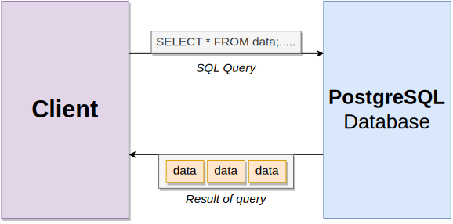
   

   

   

   

   

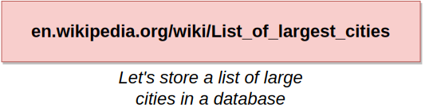
   

   

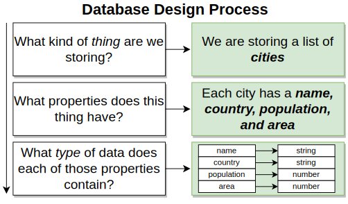
   

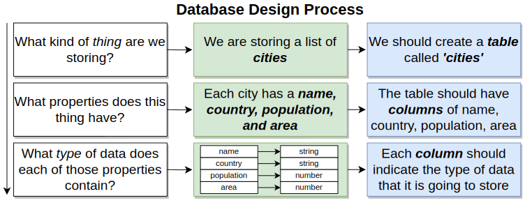
   

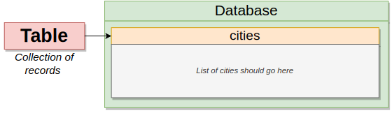
   

   

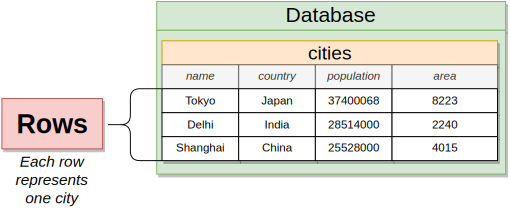
   

   

   

   

   

   

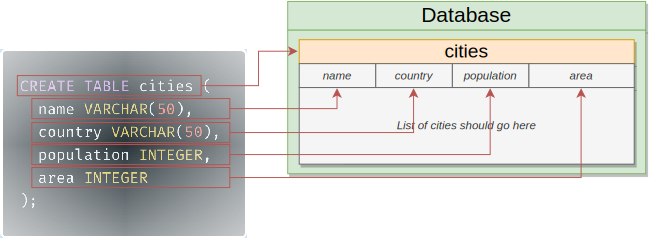
   

   

   

   

   

   

   

   

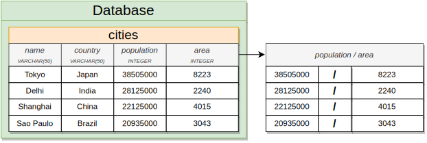
   

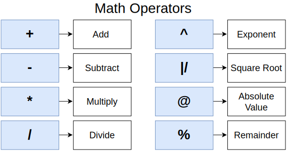
   

   

   

   

---

 

# Section 2: Filtering Records

   

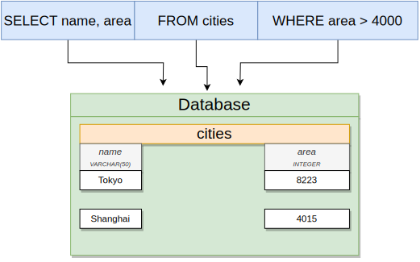
   

   

   

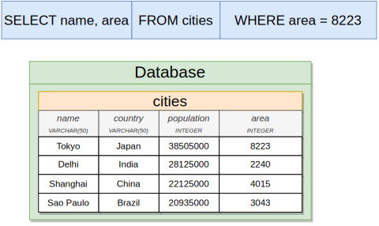
   

   

   

---

 

# Section 3: Working with Tables

   

   

   

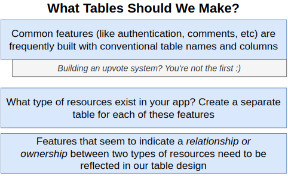
   

   

   

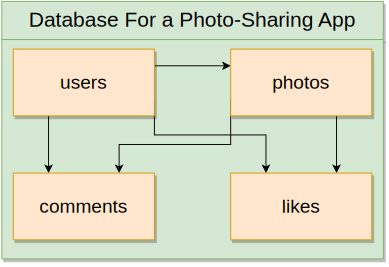
   

   

   

   

   

   

   

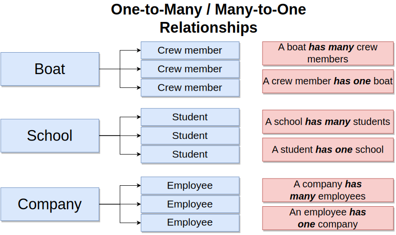
   

   

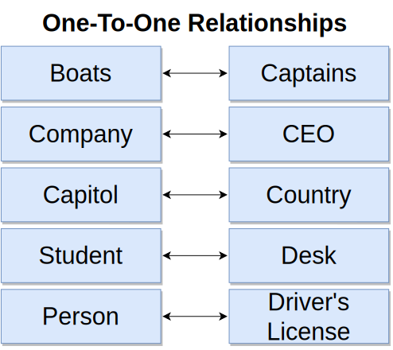
   

   

   

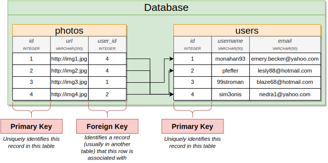
   

   

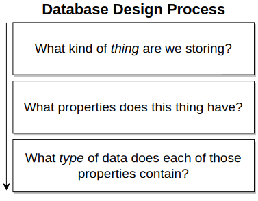
   

   

   

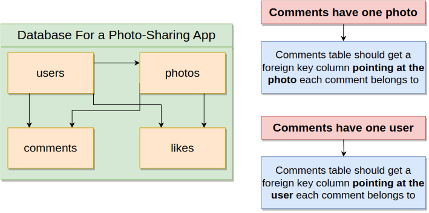
   

   

   

   

   

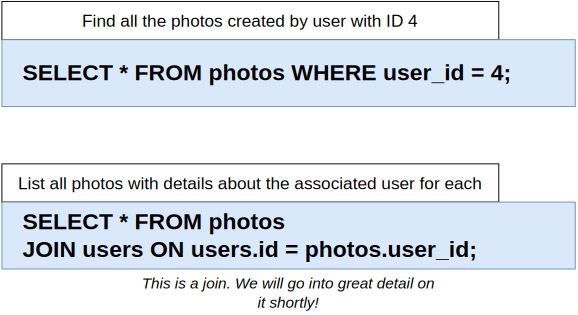
   

   

   

   

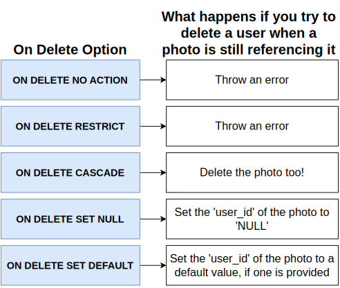
   

---

 

# Section 4: Relating Records with Joins

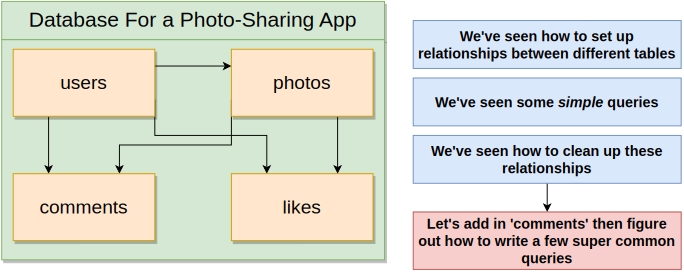
   

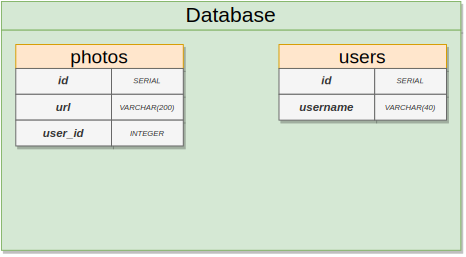
   

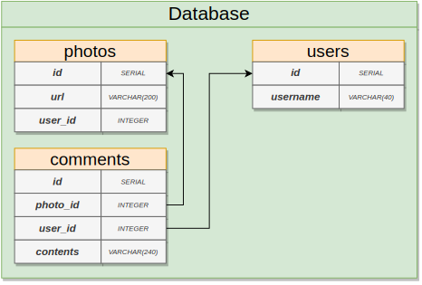
   

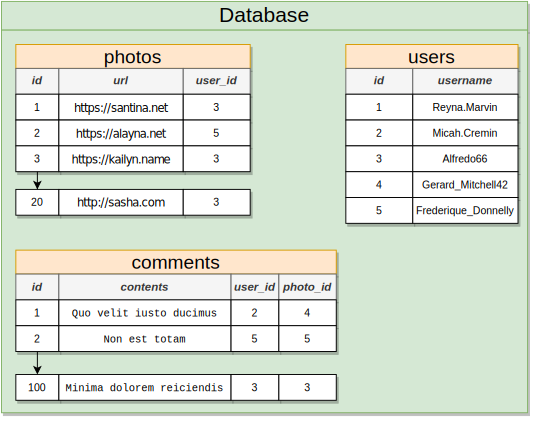
   

   

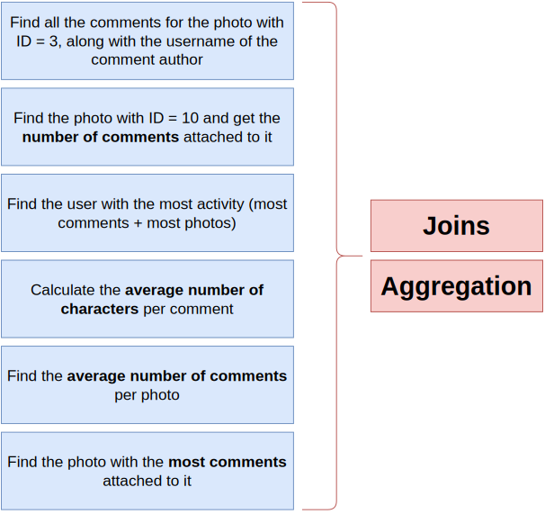
   

   

   

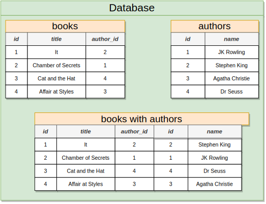
   

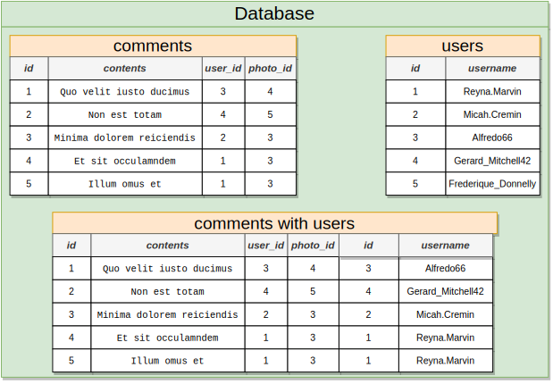
   

   

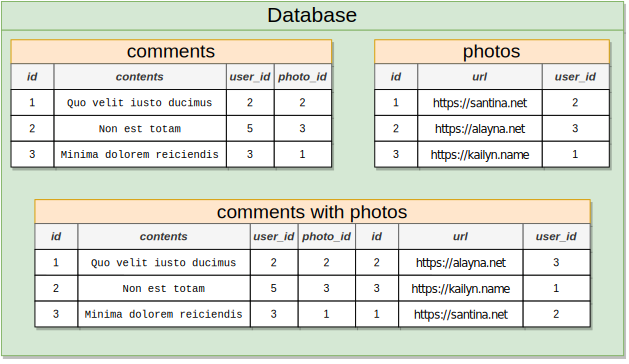
   

   

   

   

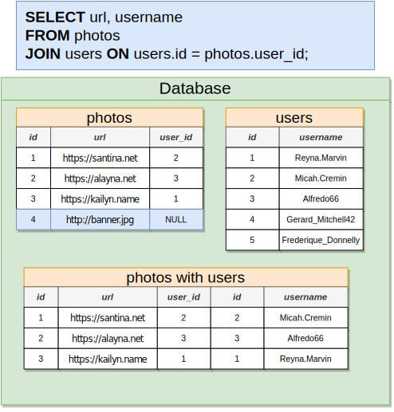
   

   

   

   

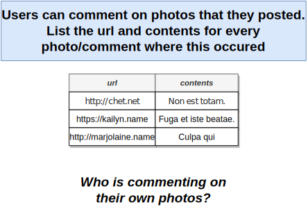
   

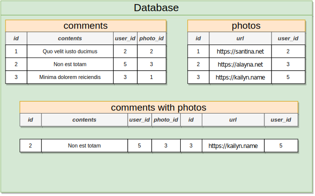
   

   

   

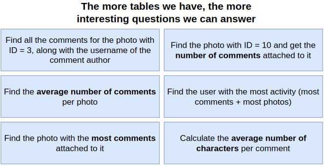
   

---

 

# Section 5: Aggregation of Records

   

   

   

   

   

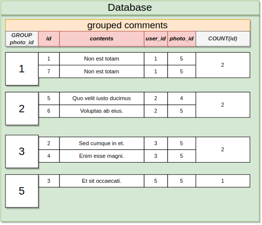
   

   

   

   

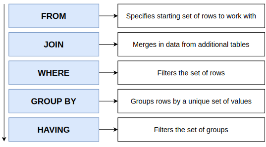
   

   

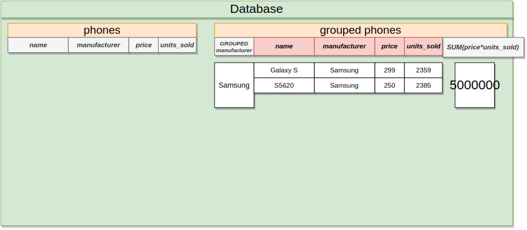
   

   

---

 

# Section 6: Working with Large Datasets

   

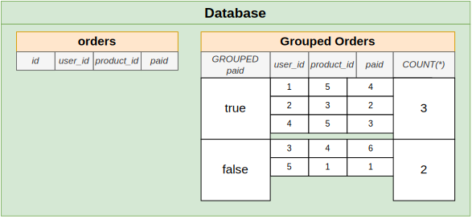
   

   

---

 

# Section 7: Sorting Records

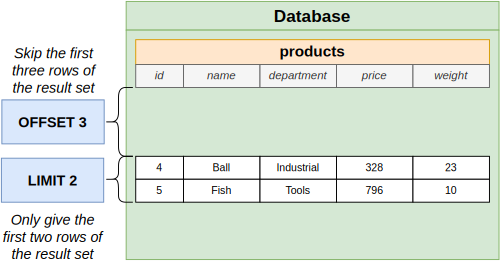
   

---

 

# Section 8: Unions and Intersections with Sets

   

   

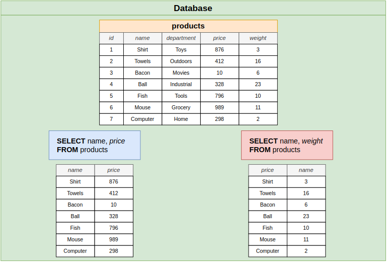
   

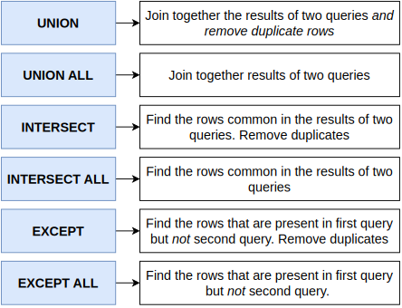
   

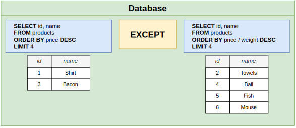
   

   

---

 

# Section 9: Assembling Queries with SubQueries

   

   

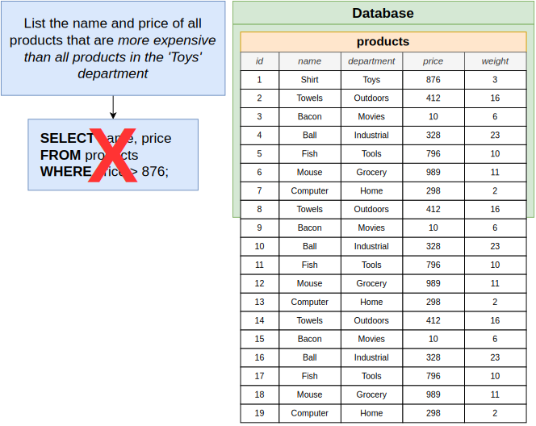
   

   

   

   

   

   

   

   

   

   

   

   

   

   

   

   

   

   

   

   

   

   

   

   

   

---

 

# Section 10: Selecting Distinct Records

   

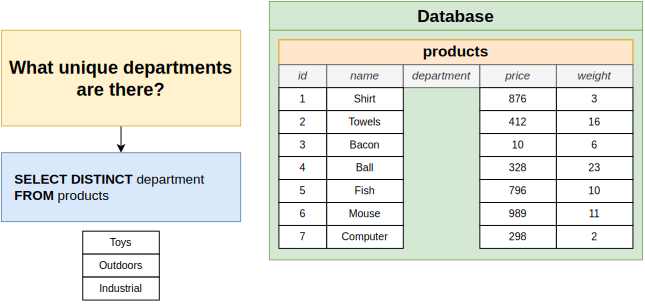
   

---

 

# Section 11: Utility Operators, Keywords, and Functions

   

   

---

 

# Section 12: Local PostgreSQL Installation

   

   

   

   

   

   

   

   

---

 

# Section 13: PostgreSQL Complex Datatypes

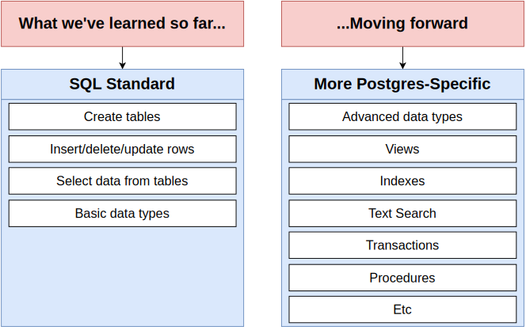
   

   

   

   

   

   

   

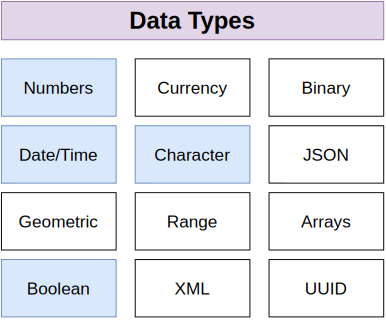
   

   

   

   

   

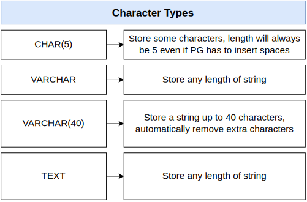
   

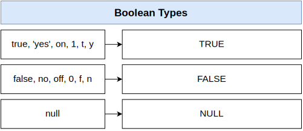
   

   

   

   

   

   

---

 

# Section 14: Database-Side Validation and Constraints

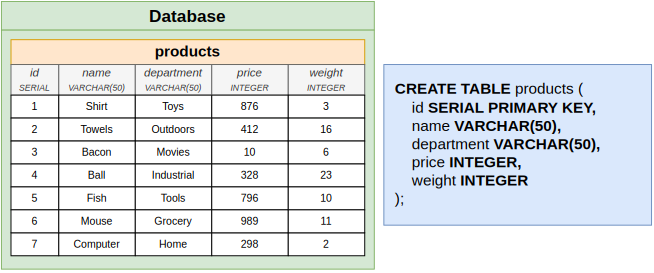
   

   

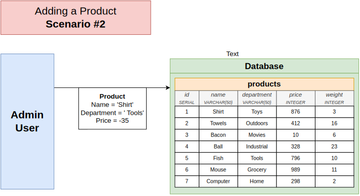
   

   

   

   

   

   

   

   

   

   

   

   

   

---

 

# Section 15: Database Structure Design Patterns

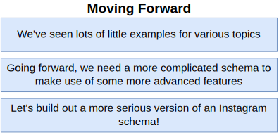
   

   

   

   

---

 

# Section 16: How to Build a 'Like' System

   

   

   

   

   

   

   

   

   

   

   

   

   

   

   

   

   

   

   

   

   

---

 

# Section 17: How to Build a 'Mention' System

   

   

   

   

   

   

   

   

   

   

---

 

# Section 18: How to Build a 'Hashtag' System

   

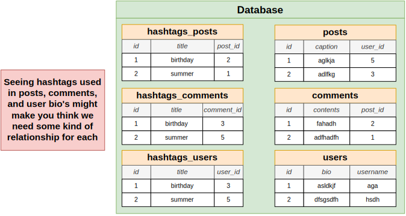
   

   

   

   

   

   

---

 

# Section 19: How to Design a 'Follower' System

   

   

   

   

   

   

   

   

   

---

 

# Section 20: Implementing Database Design Patterns

   

   

   

   

---

 

# Section 21: Approaching and Writing Complex Queries

## Seeding a Database

   

   

   

   

   

   

   

   

   

## Restoring a Backup

   

   

   

   

## Writing Complex Queries

   

   

   

---

 

# Section 22: Understanding the Internals of PostgreSQL

   

   

   

   

   

   

   

   

   

   

   

   

   

   

   

   

   

   

   

---

 

# Section 23: A Look at Indexes for Performance

   

   

   

   

   

   

   

   

   

   

   

   

   

   

   

   

   

   

   

   

   

   

   

   

   

   

   

---

 

# Section 24: Basic Query Tuning

   

   

   

   

   

   

   

   

   

   

   

   

   

   

   

   

   

   

   

   

   

   

   

---

 

# Section 25: Advanced Query Tuning

   

   

   

   

   

   

---

 

# Section 26: Simple Common Table Expressions

   

   

   

---

 

# Section 27: Recursive Common Table Expressions

   

   

   

   

   

   

   

   

   

   

---

 

# Section 28: Simplifying Queries with Views

   

   

   

   

   

   

   

   

   

   

   

   

   

   

---

 

# Section 29: Optimizing Queries with Materialized Views

   

   

   

   

   

   

---

 

# Section 30: Handling Concurrency and Reversibility with Transactions

   

   

   

   

   

   

   

   

   

   

   

   

   

---

 

# Section 31: Managing Database Design with Schema Migrations

   

   

   

   

   

   

   

   

   

   

   

   

   

   

   

   

   

   

   

   

   

   

   

   

   

   

   

   

   

   

   

   

   

   

   

   

---

 

# Section 32: Schema vs Data Migrations

   

   

   

   

   

   

   

   

   

   

   

   

   

   

   

   

   

   

   

   

   

   

---

 

# Section 33: Accessing PostgreSQL From API's

   

   

   

   

   

   

   

   

   

   

   

   

---

 

# Section 34: Data Access Pattern - Repositories

   

   

   

   

   

---

 

# Section 35: Security Around PostgreSQL

   

   

   

   

   

   

---

 

# Section 36: Fast Parallel Testing

   

   

   

   

   

   

   

   

   

   

   

   

   

   

   

   

   

   

---

 

# Left Over Screenshots!!!

# SEPARATE 1

   

   

   

   

   

   

   

   

   

   

   

   

   

   

   

   

   

   

   

   

   

   

   

# SEPARATE 2

   

   

   

   

   

   

   

   

   

   

   

   

   

   

   

   

   

   

   

   

# SEPARATE 15
# SEPARATE 21
# SEPARATE 22
# SEPARATE 23

   

   

   

   

   

   

   

   

   

   

   

   

   

   

   

   

   

# SEPARATE 24

   

   

   

   

   

