# SEPARATE 1

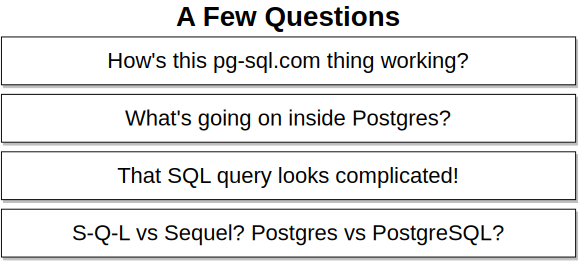
   

   

   

   

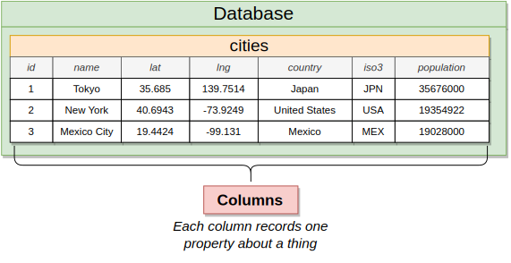
   

   

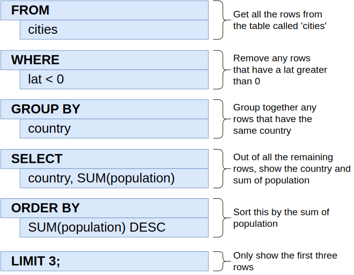
   

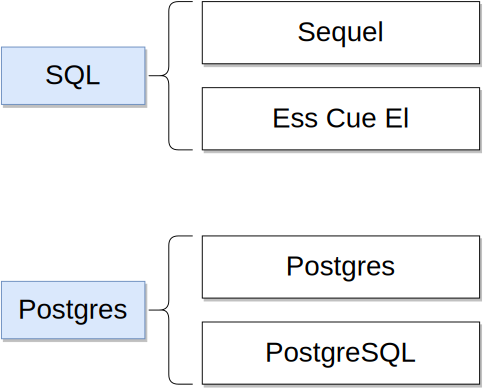
   

   

   

   

   

   

   

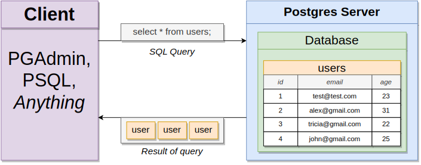
   

   

   

   

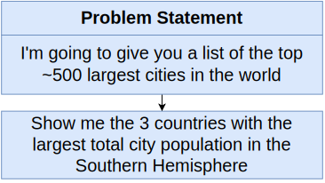
   

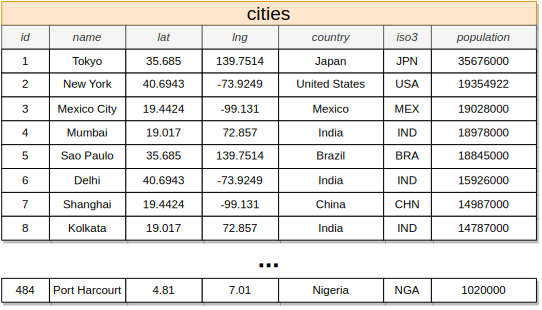
   

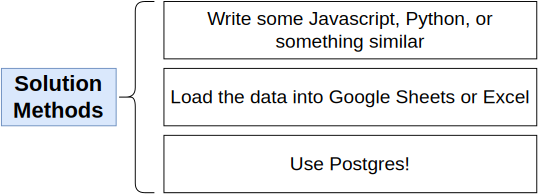
   

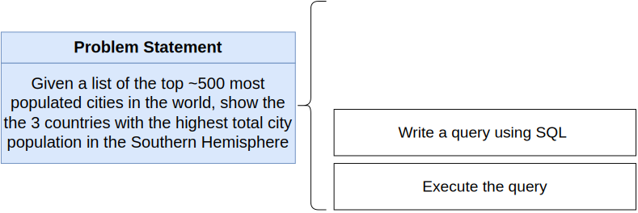
   

   

# SEPARATE 2

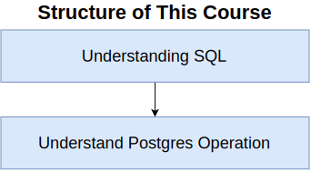
   

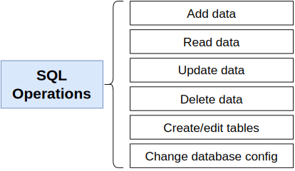
   

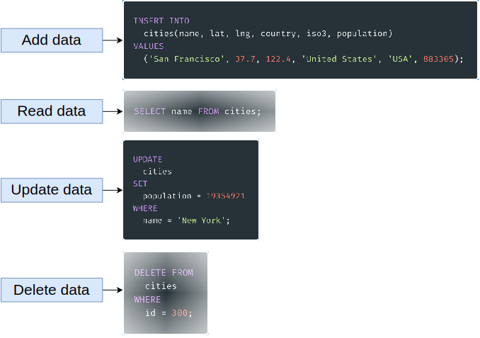
   

   

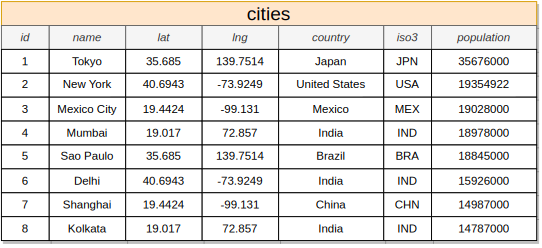
   

   

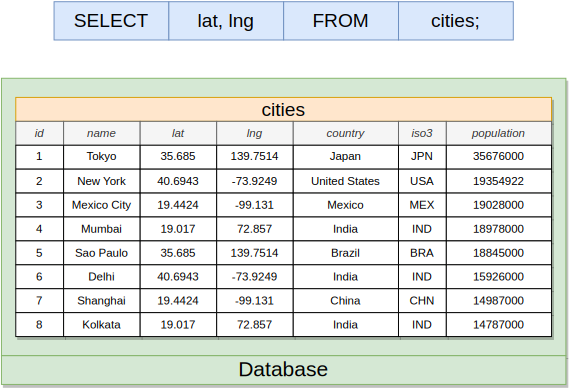
   

   

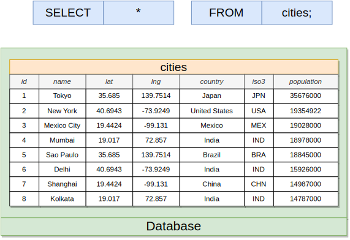
   

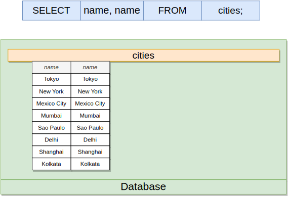
   

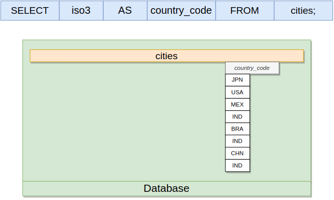
   

   

   

   

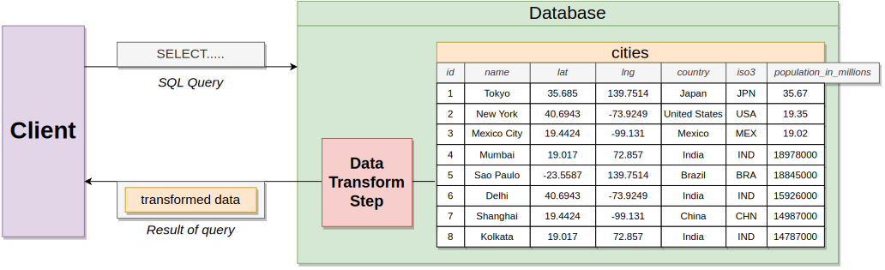
   

   

   

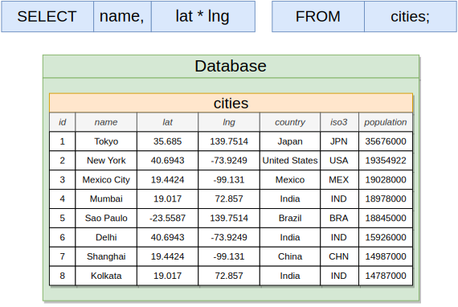
   

   

   

# SEPARATE 23

   

   

   

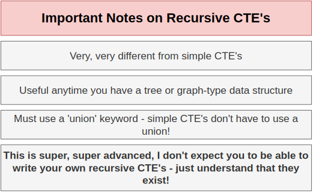
   

   

   

   

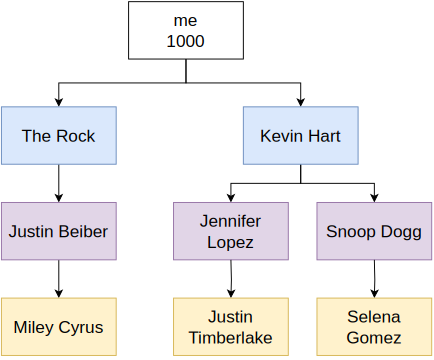
   

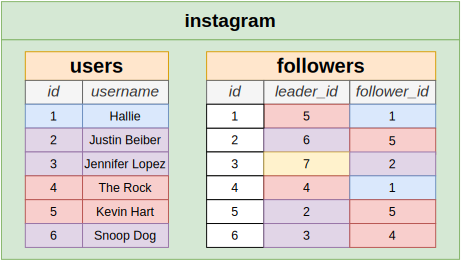
   

   

   

   

   

   

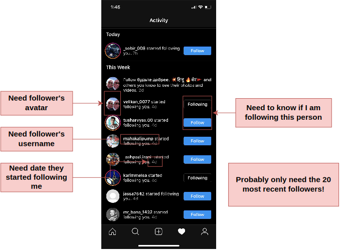
   

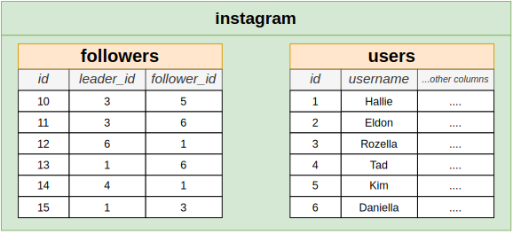
   

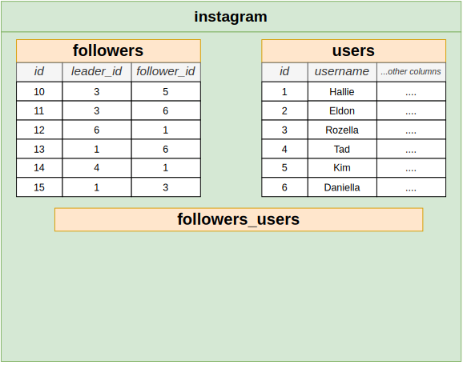
   

# SEPARATE 24

   

   

   

   

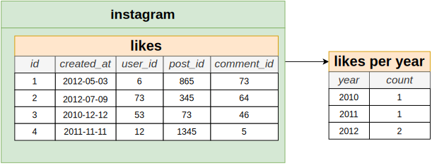
   
