# Section 31: Managing Database Design with Schema Migrations

   

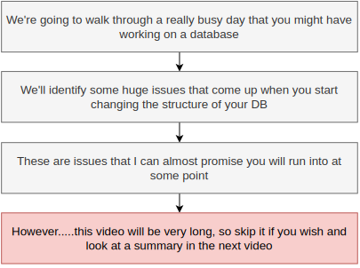
   

   

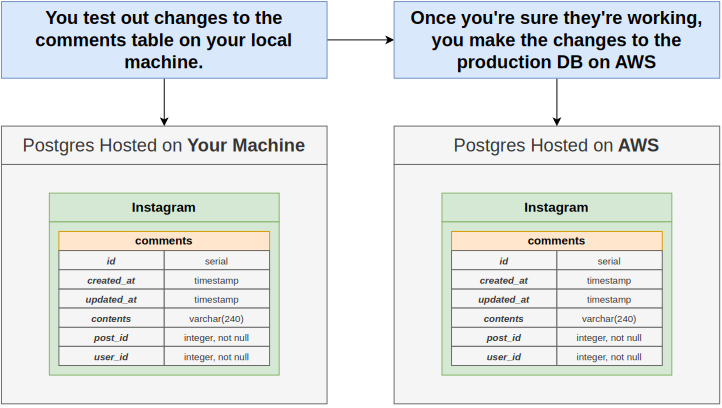
   

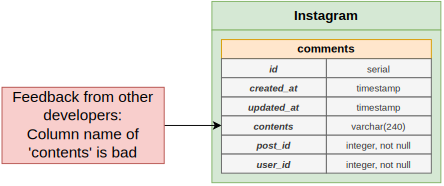
   

   

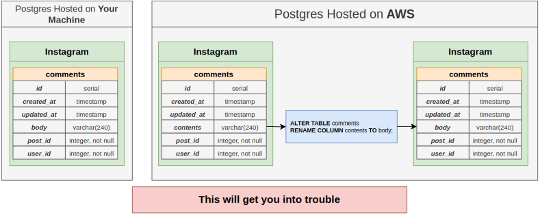
   

   

   

   

   

   

   

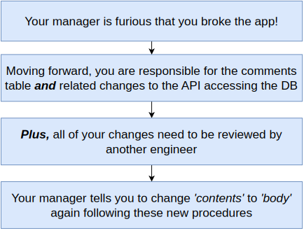
   

   

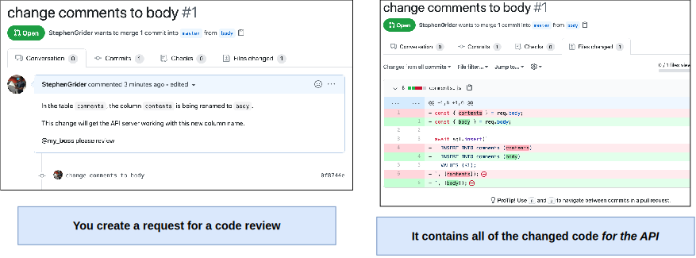
   

   

   

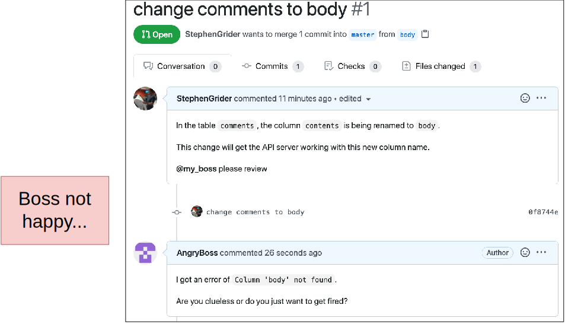
   

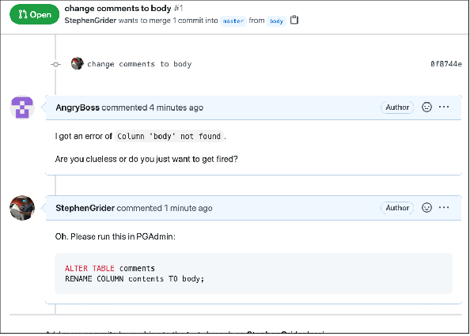
   

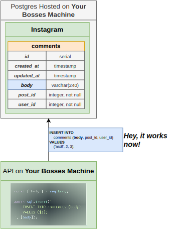
   

   

   

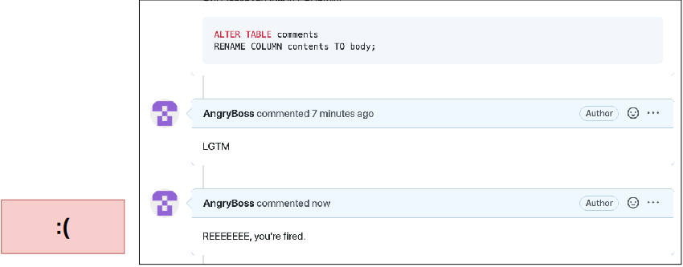
   

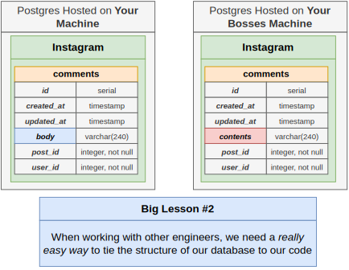
   

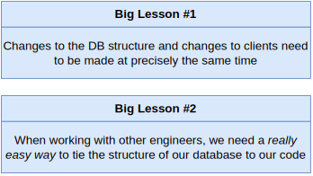
   

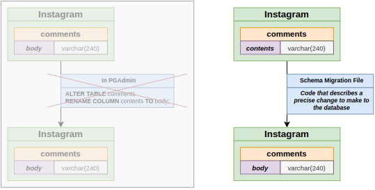
   

   

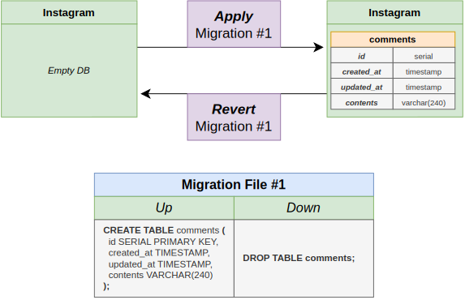
   

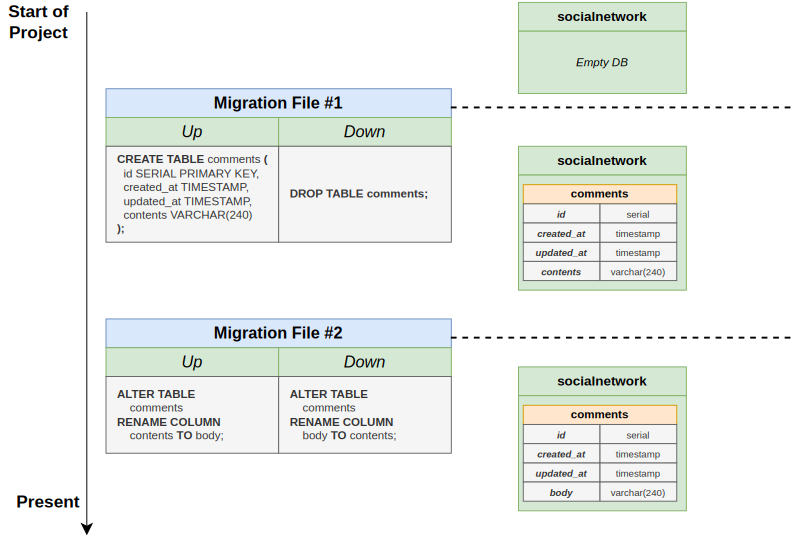
   

   

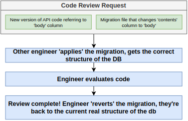
   

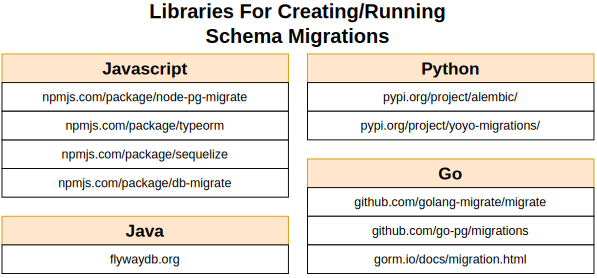
   

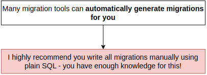
   

   

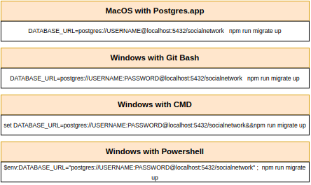
   
