# Section 1: Simple - But Powerful - SQL Statements

# Table of Contents

1. 

---

 

   

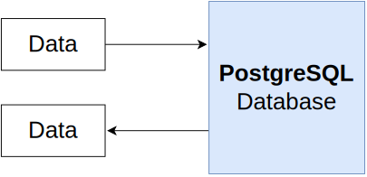
   

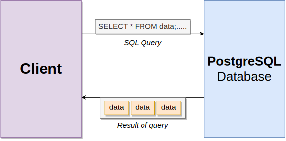
   

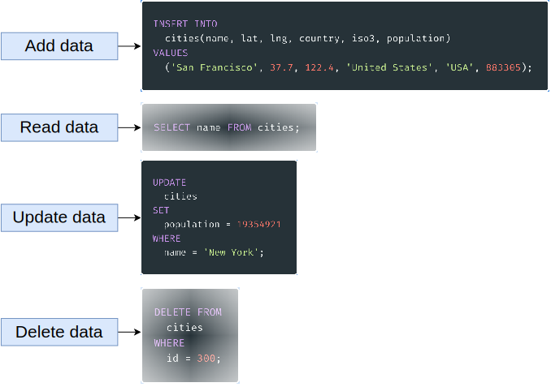
   

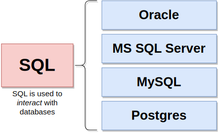
   

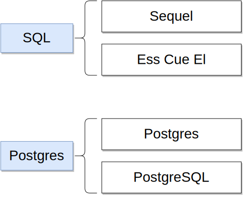
   

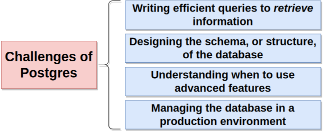
   

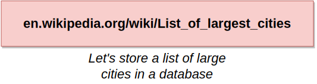
   

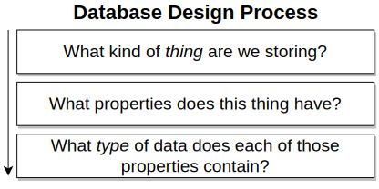
   

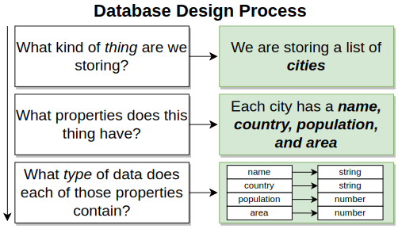
   

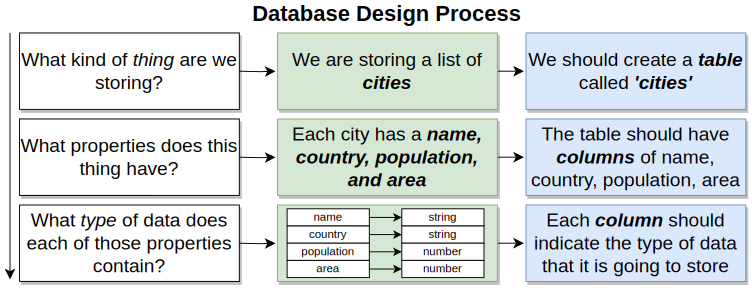
   

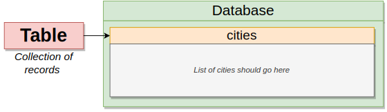
   

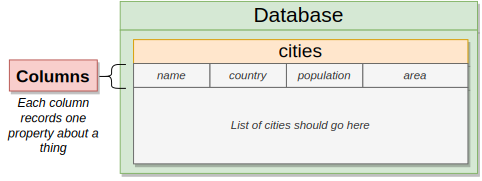
   

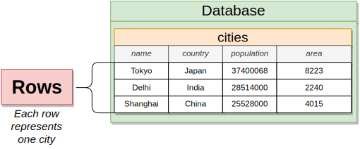
   

   

   

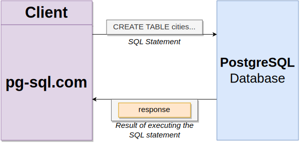
   

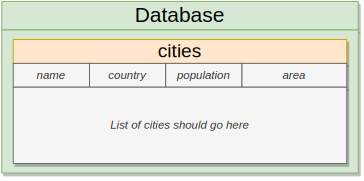
   

   

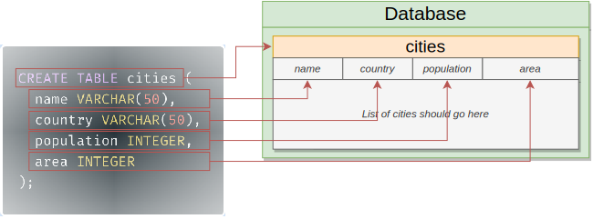
   

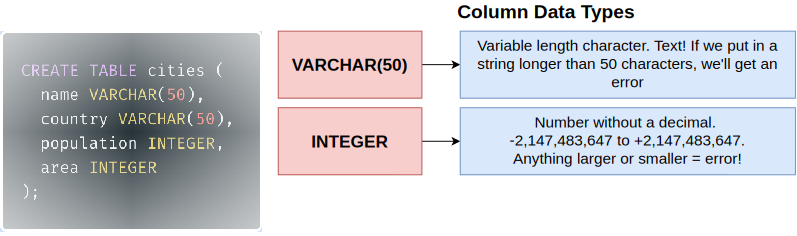
   

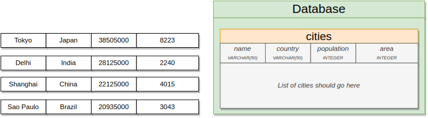
   

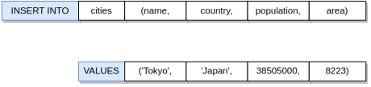
   

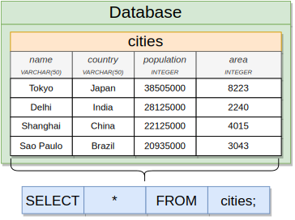
   

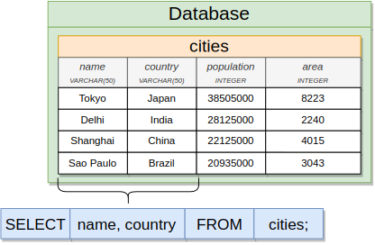
   

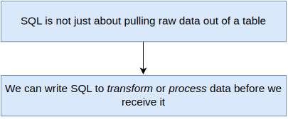
   

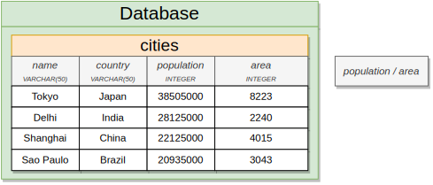
   

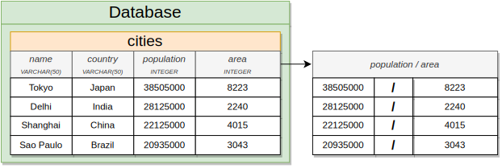
   

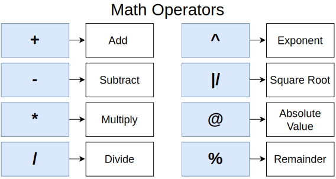
   

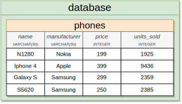
   

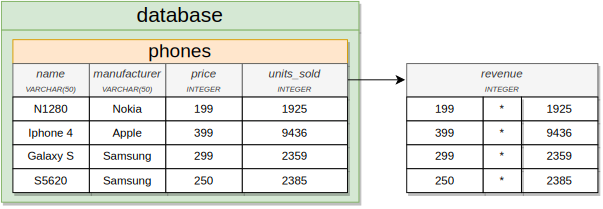
   

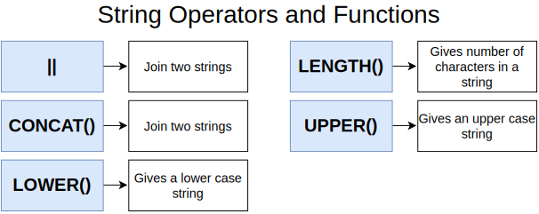
   
