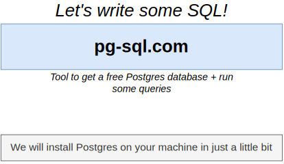
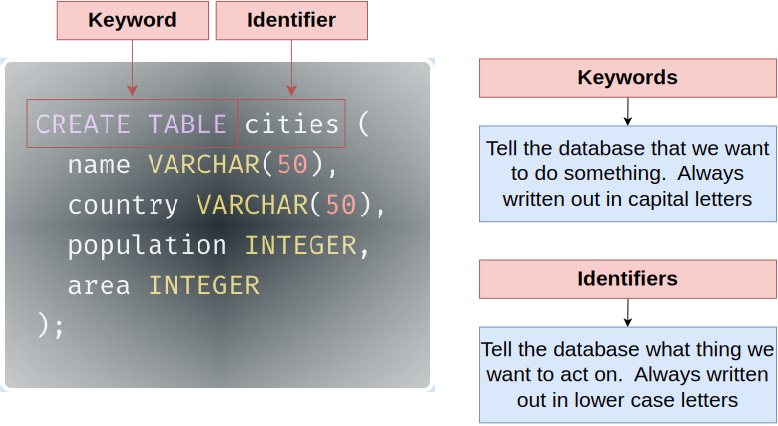

# Section 1: Simple - But Powerful - SQL Statements

## Table of Contents

1. [CRUD Operation](#crud-operation)
1. [SQL Databases](#sql-databases)
1. [Pronunciation](#pronunciation)
1. [Database Challenges](#database-challenges)
1. [Database Design Process](#database-design-process)
1. [Table](#table)
1. [Columns](#columns)
1. [Rows](#rows)
1. [Keywords vs Identifiers](#keywords-vs-identifiers)
1. [Math Operators](#math-operators)
1. [String Operators and Function](#string-operators-and-function)

---

 

   

   

   

## CRUD Operation

   

## SQL Databases

   

## Pronunciation

   

## Database Challenges

   

## Database Design Process

   

   

   

   

### Table

   

### Columns

   

### Rows

   

   

   

   

   

### Keywords vs Identifiers

   

   

   

   

   

   

   

   

## Math Operators

   

   

   

   

   

## String Operators and Function

   
