# Section 3: Working with Tables

## Table of Contents

1. [Why Many Tables](#table-of-contents)
1. [What Tables Should We Make](#why-many-tables)
1. [One-to-Many Relationship](#one-to-one-relationship)
1. [Many-to-One Relationship](#many-to-one-relationship)
1. [One-to-Many vs Many-to-One](#one-to-many-vs-many-to-one)
1. [One-to-One Relationship](#one-to-many-relationship)
1. [Many-to-Many Relationship](#many-to-many-relationship)
1. [Primary Key](#primary-key)
1. [Foreign Key](#foreign-key)
1. [On Delete Options](#on-delete-options)

---

 

## Why Many Tables

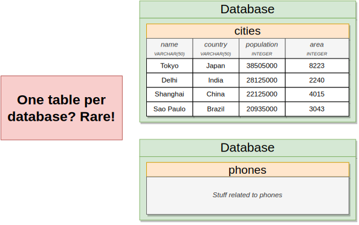
   

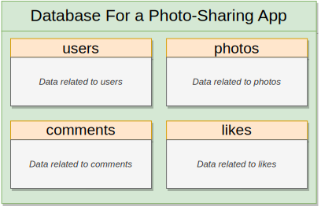
   

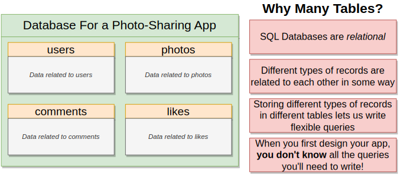
   

## What Tables Should We Make

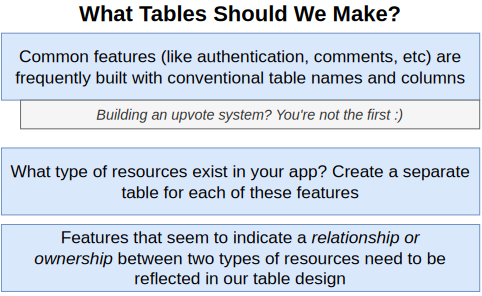
   

   

   

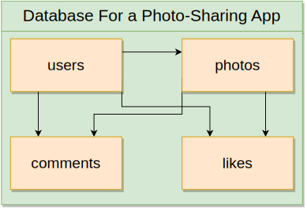
   

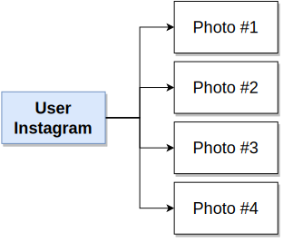
   

## One-to-Many Relationship

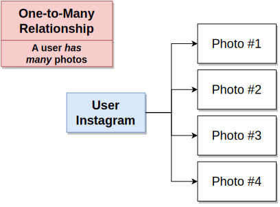
   

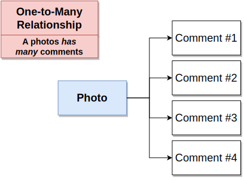
   

## Many-to-One Relationship

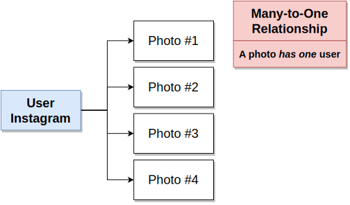
   

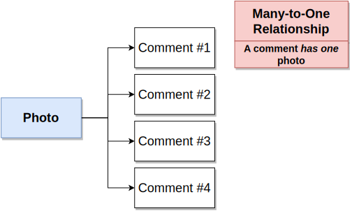
   

## One-to-Many vs Many-to-One

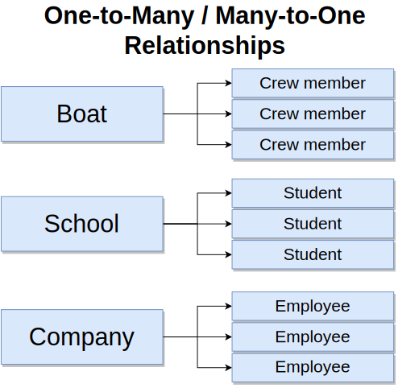
   

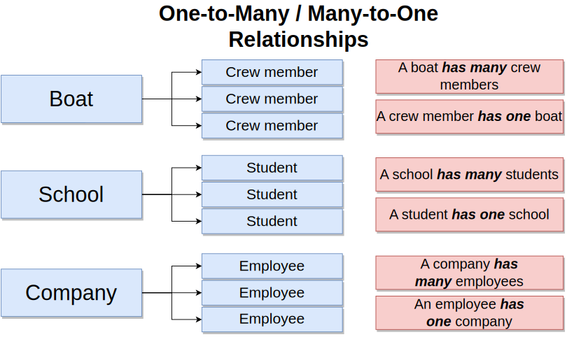
   

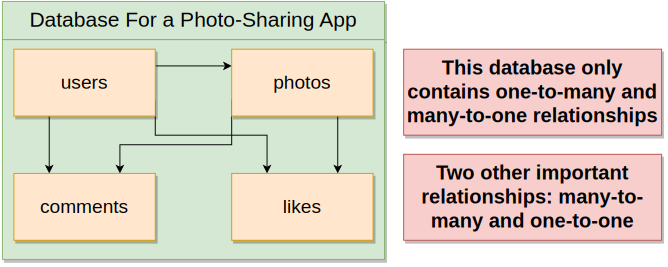
   

## One-to-One Relationship

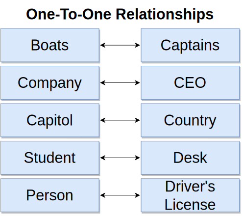
   

## Many-to-Many Relationship

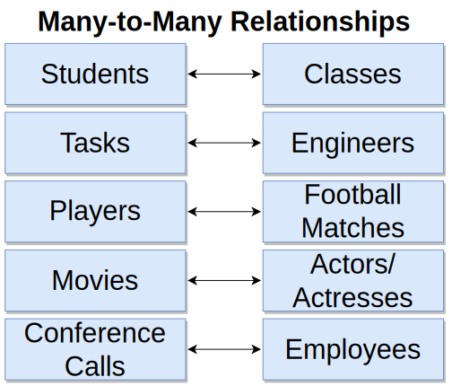
   

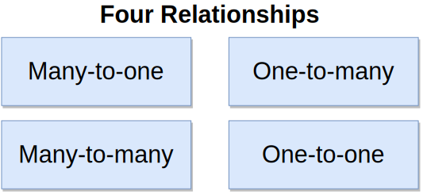
   

## Primary Key vs Foreign Key

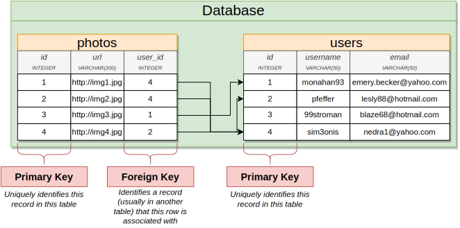
   

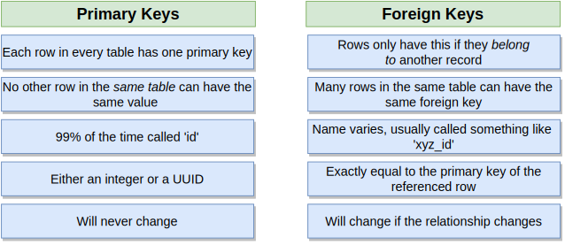
   

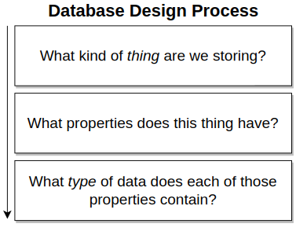
   

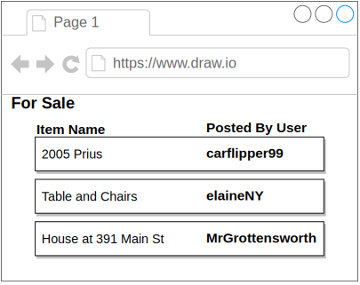
   

   

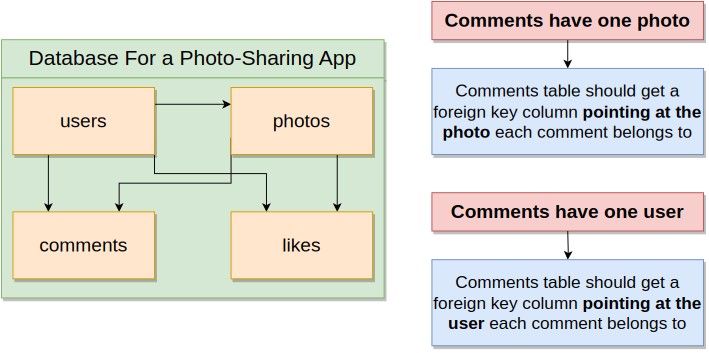
   

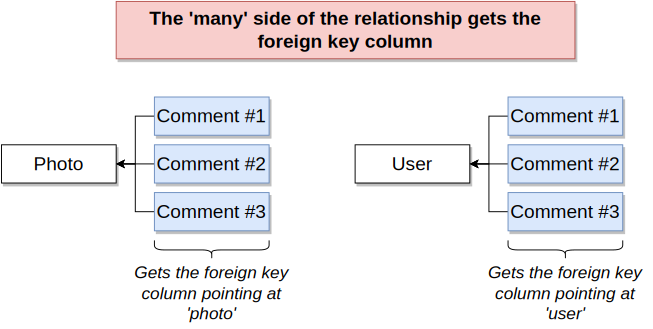
   

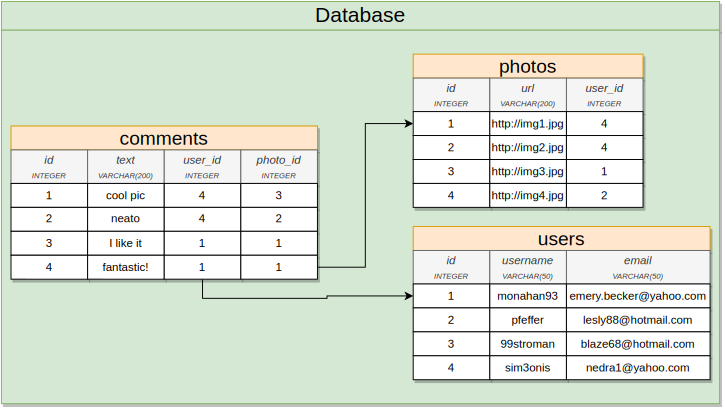
   

   

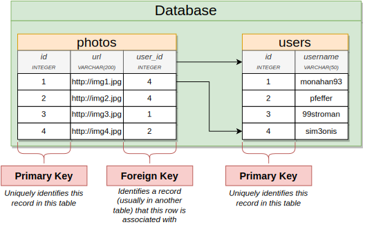
   

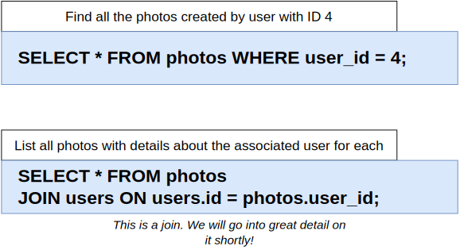
   

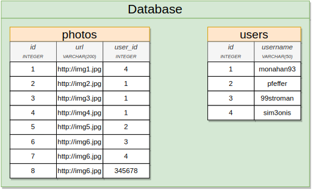
   

## On Delete Options

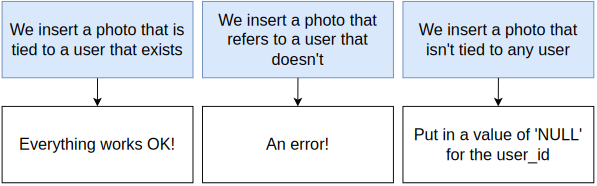
   

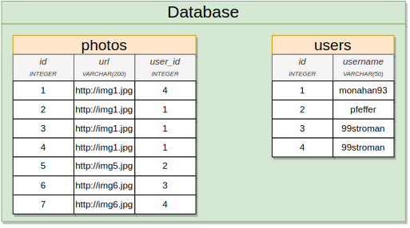
   

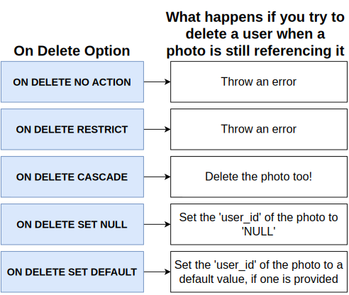
   
