# Section 9: Assembling Queries with SubQueries

## Table of Contents

1. [Where Subquery Can Be Used](#where-subquery-can-be-used)
1. [Select Subquery](#select-subquery)
1. [From Subquery](#from-subquery)
1. [Join Subquery](#join-subquery)
1. [Comparison Subquery](#comparison-subquery)
1. [Subquery For Each Comparison Operator](#subquery-for-each-comparison-operator)

---

 

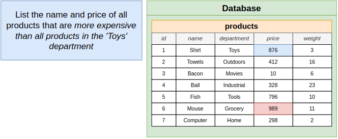
   

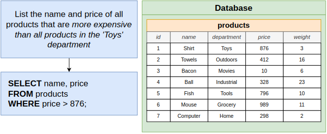
   

   

   

   

## Where Subquery Can Be Used

   

   

## Select Subquery

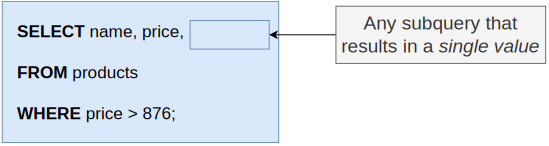
   

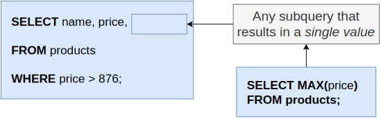
   

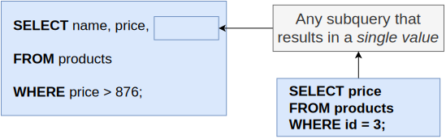
   

## From Subquery

   

   

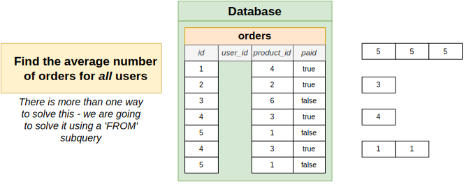
   

   

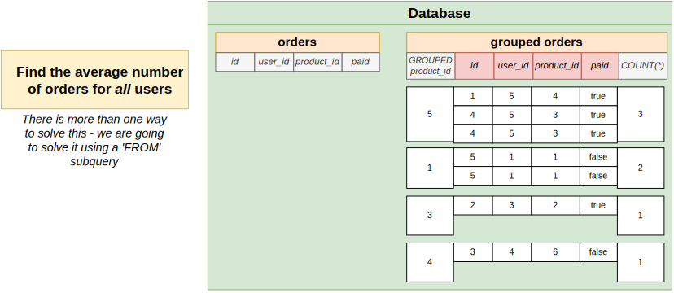
   

## Join Subquery

   

   

## Comparison Subquery

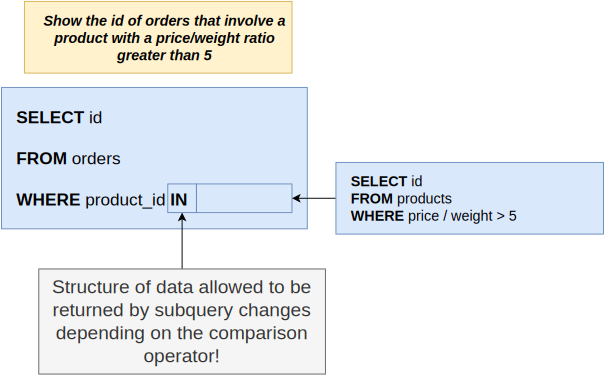
   

   

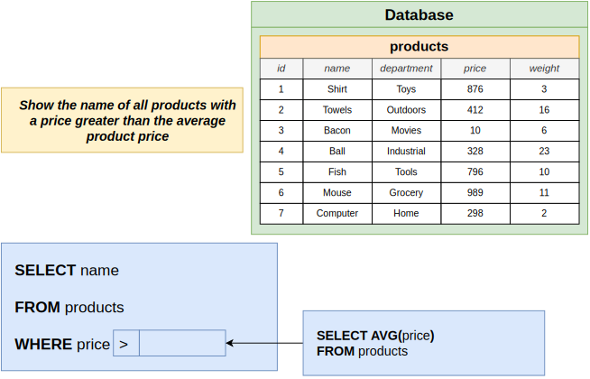
   

   

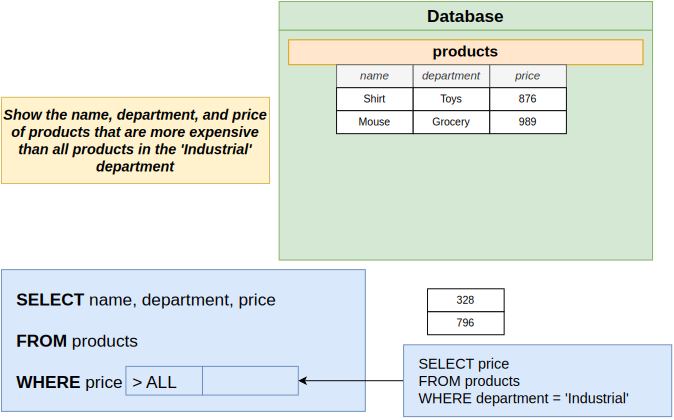
   

## Subquery For Each Comparison Operator

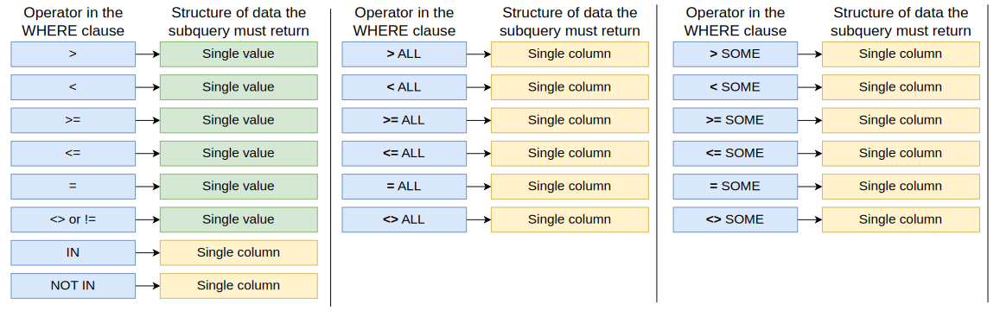
   

   

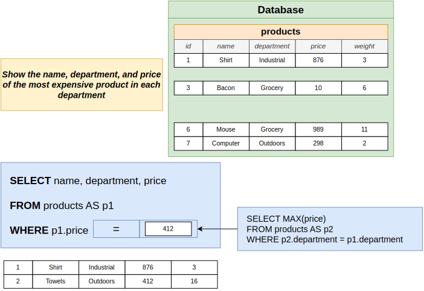
   

   
