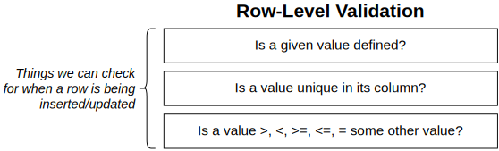
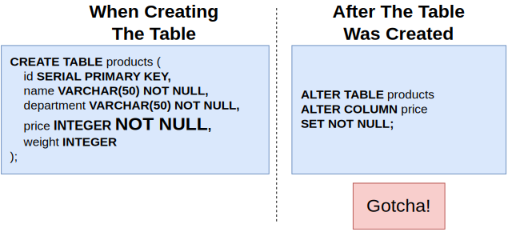
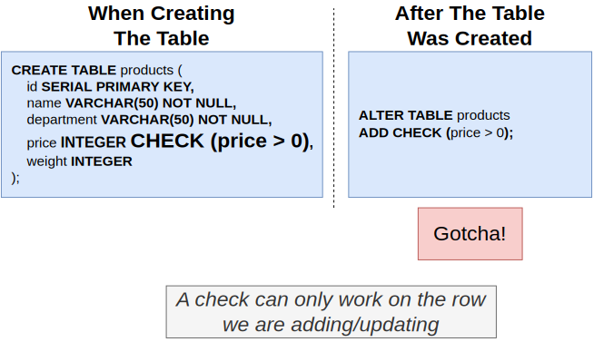
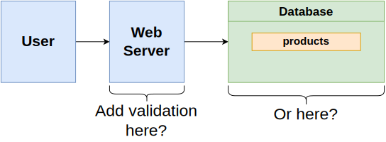

# Section 14: Database-Side Validation and Constraints

## Table of Contents

1. [Row Level Validation](#row-level-validation)
1. [Add Validation When Creating the Table and After](#add-validation-when-creating-the-table-and-after)
1. [Add Validation to the API vs to the Database](#add-validation-to-the-api-vs-to-the-database)

---

 

   

   

   

## Row Level Validation 

   

   

   

## Add Validation When Creating the Table and After

   

   

   

   

   

   

   

## Add Validation to the API vs to the Database

   

   
