# Section 22: Understanding the Internals of PostgreSQL

## Table of Contents

1. [Performance with Postgres](#performance-with-postgres)
1. [Heap File, Tuple or Item, Block or Page](#heap-file-tuple-or-item-block-or-page)

---

 

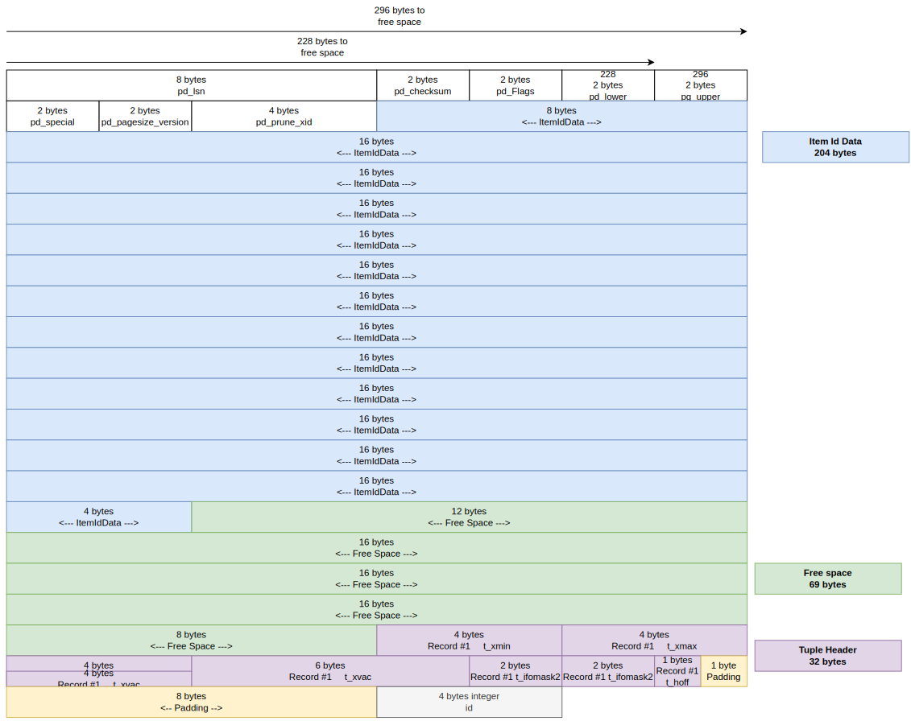
   

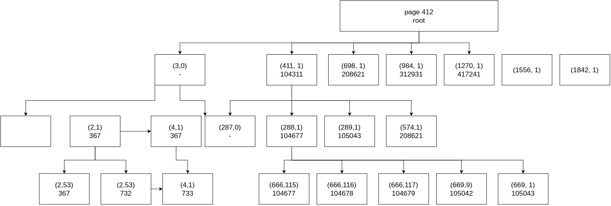
   

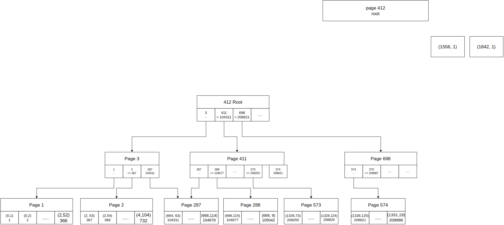
   

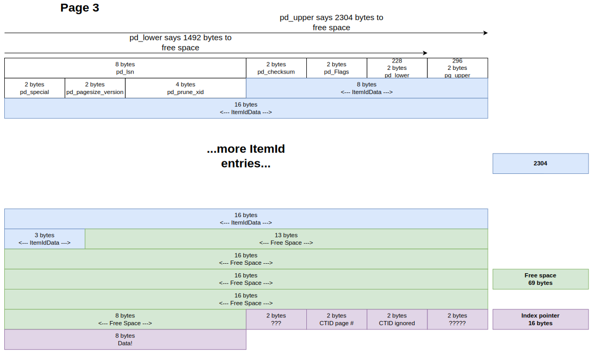
   

## Performance with Postgres

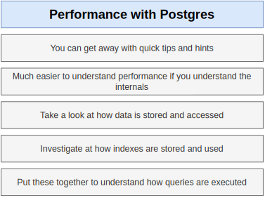
   

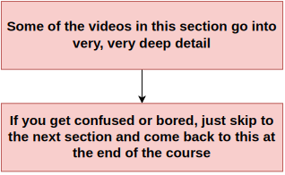
   

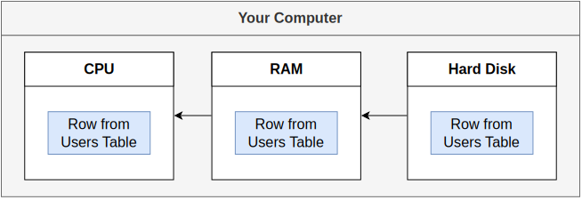
   

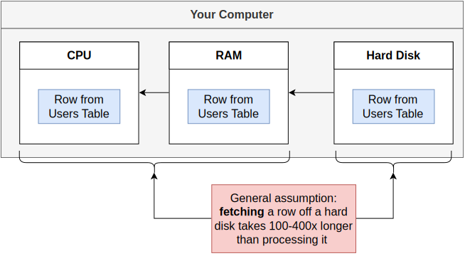
   

## Heap File, Tuple or Item, Block or Page

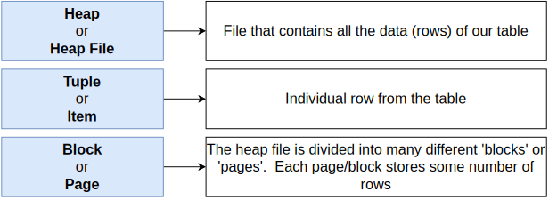
   

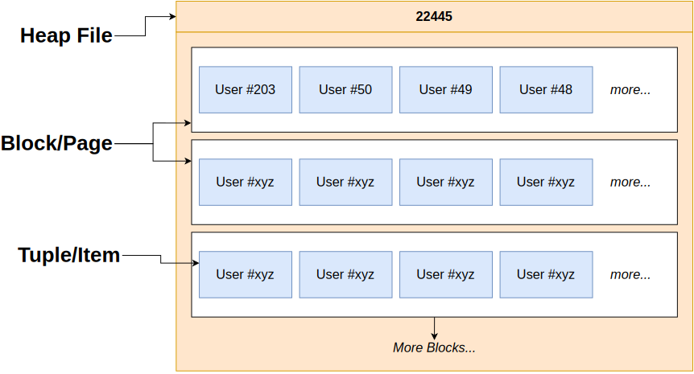
   

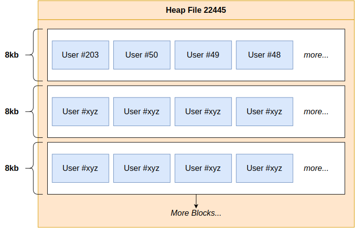
   

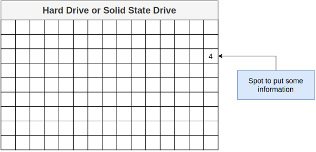
   

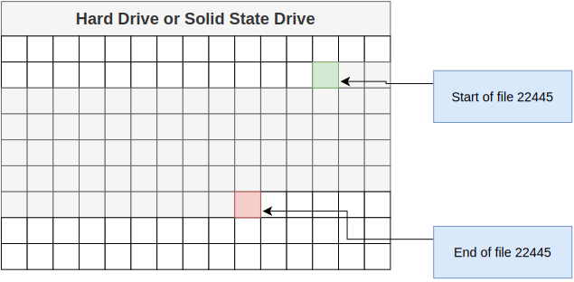
   

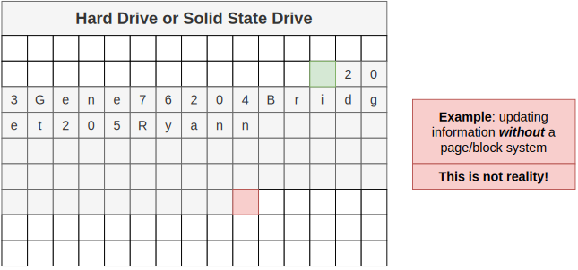
   

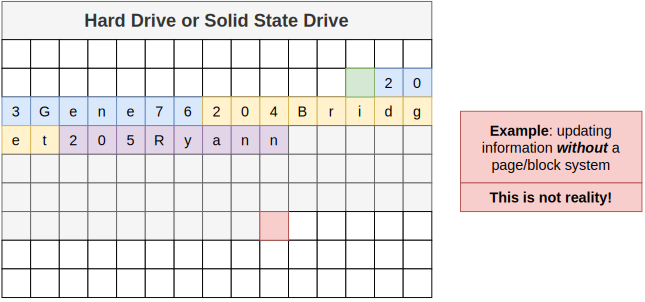
   

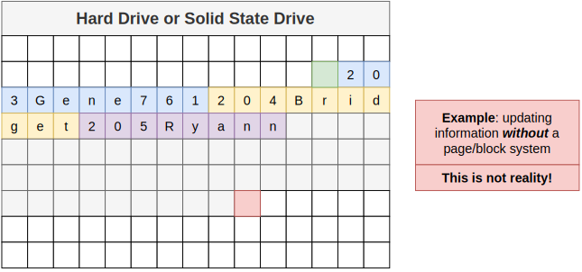
   

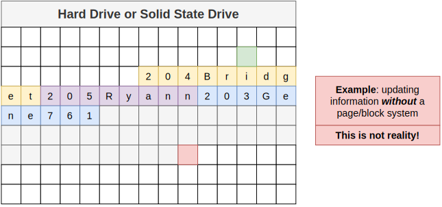
   

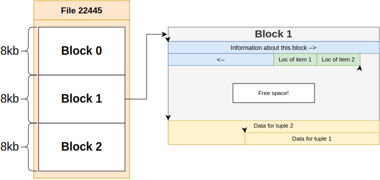
   

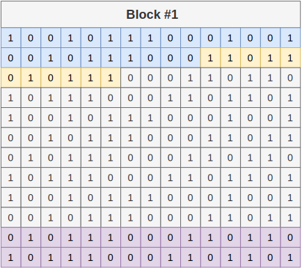
   
