# Section 23: A Look at Indexes for Performance

## Table of Contents

1. [Full Table Scan](#full-table-scan)
1. [Downsides of Indexes](#downsides-of-indexes)
1. [Types of Indexes](#types-of-indexes)
1. [Indexes in Postgres](#indexes-in-postgres)

---

 

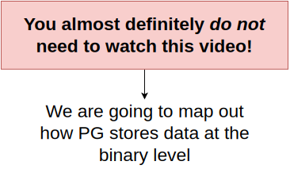
   

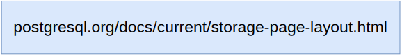
   

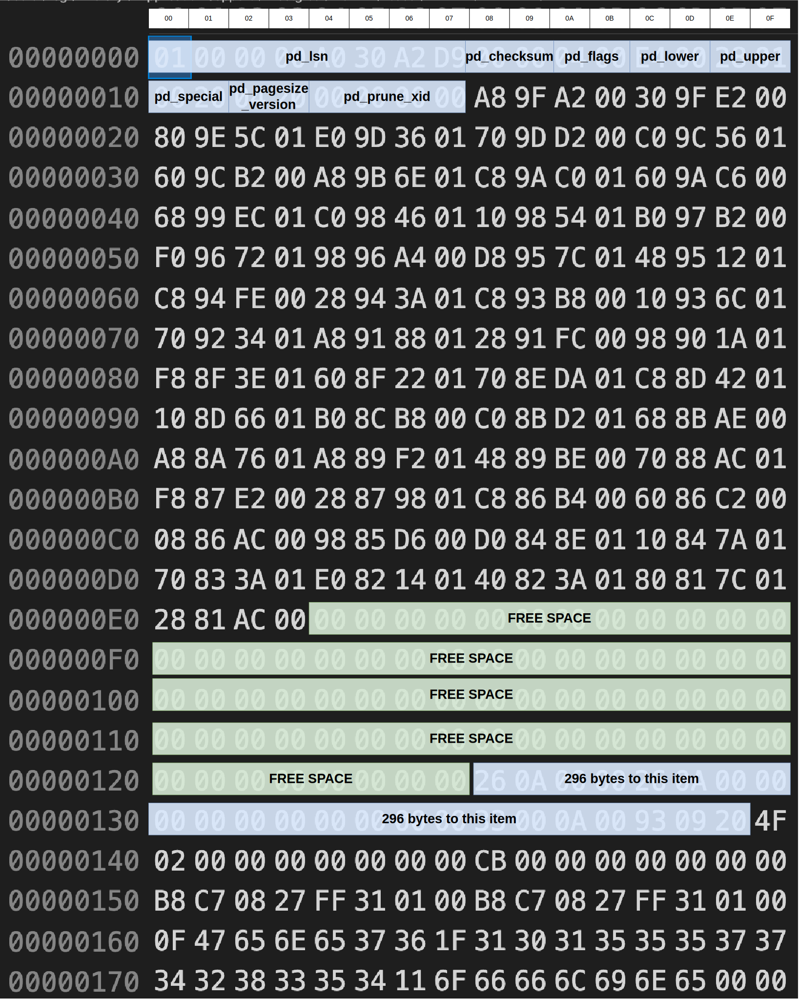
   

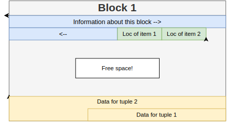
   

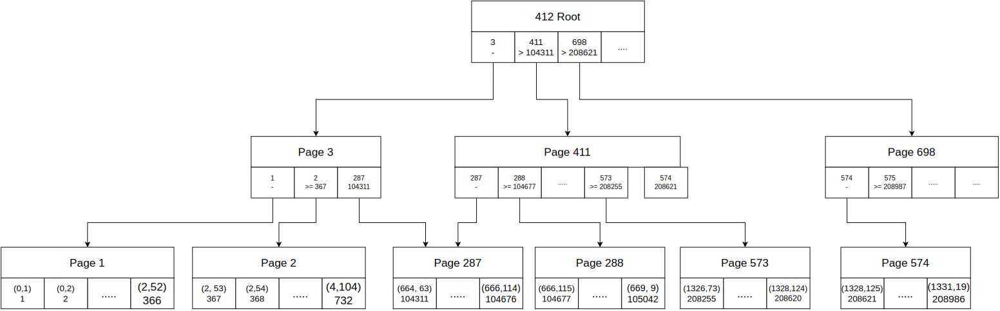
   

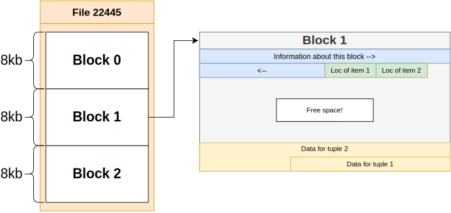
   

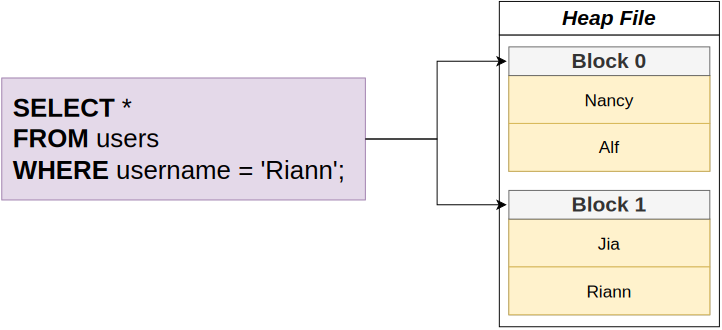
   

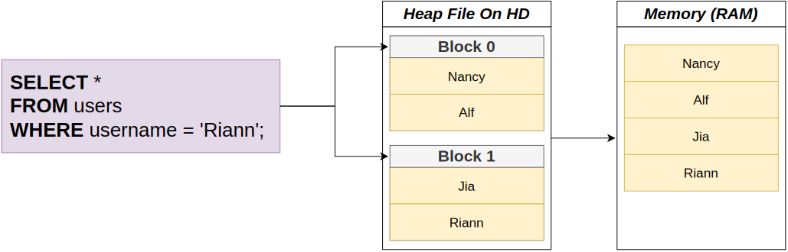
   

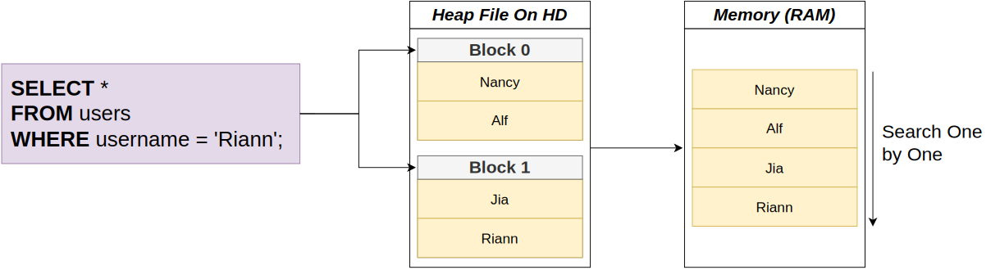
   

## Full Table Scan

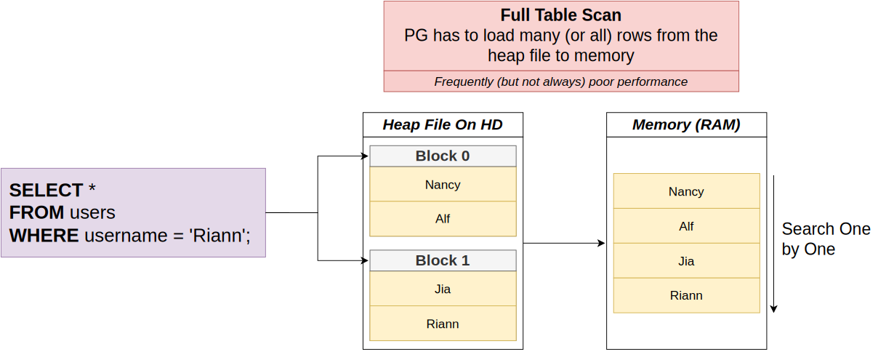
   

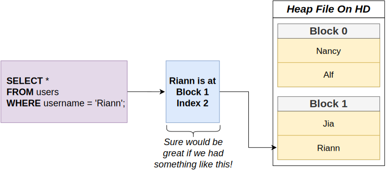
   

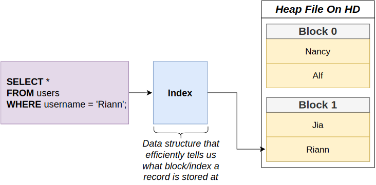
   

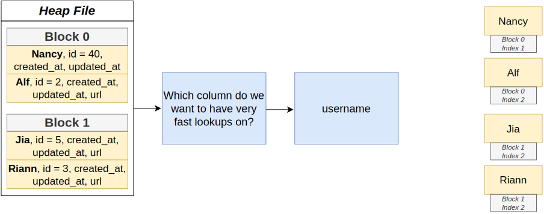
   

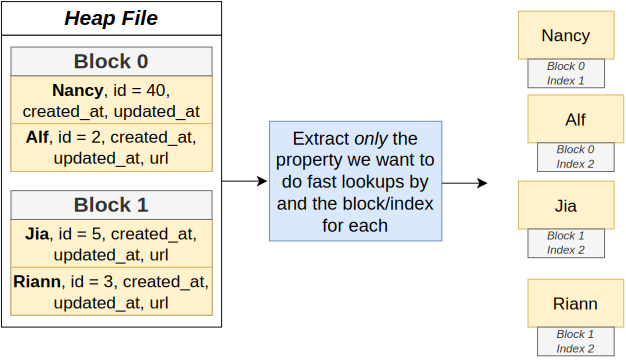
   

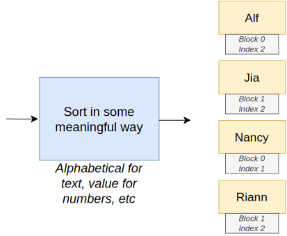
   

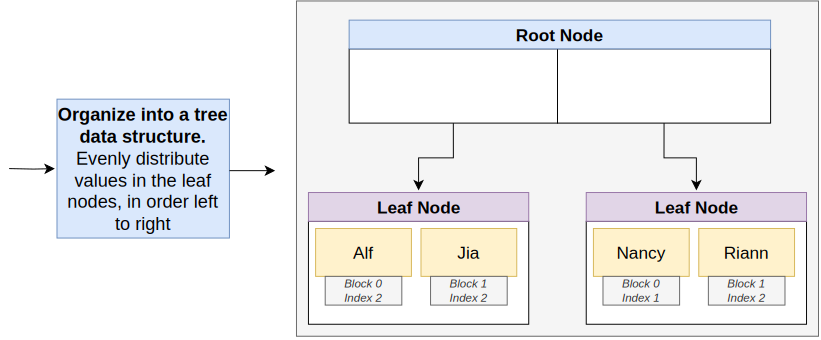
   

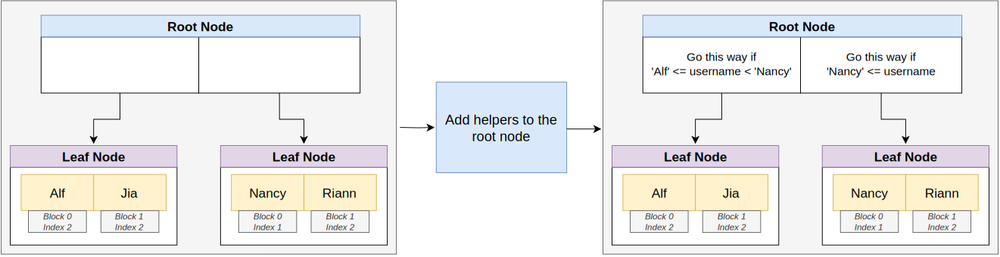
   

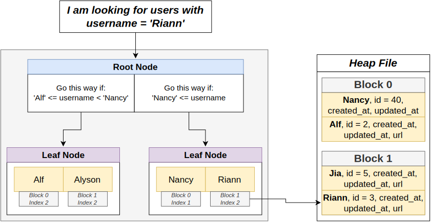
   

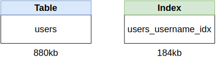
   

## Downsides of Indexes

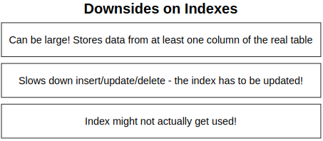
   

## Types of Indexes

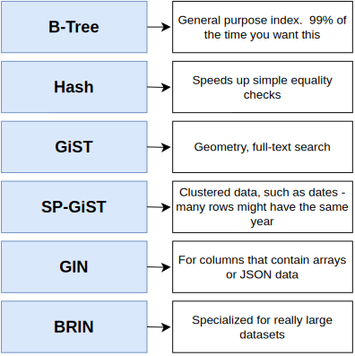
   

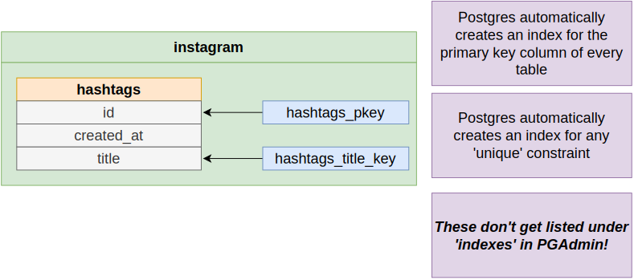
   

## Indexes in Postgres

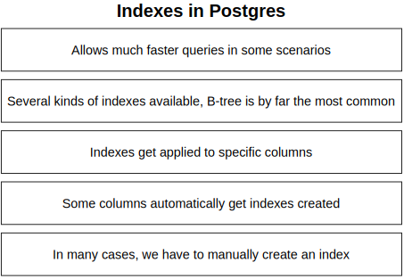
   

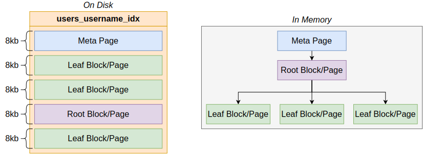
   

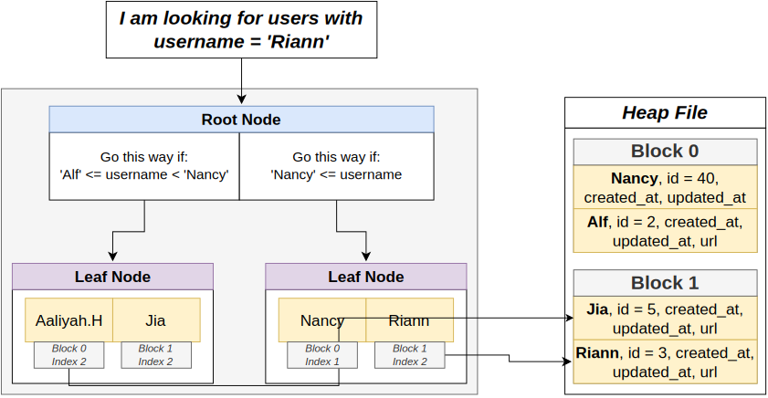
   

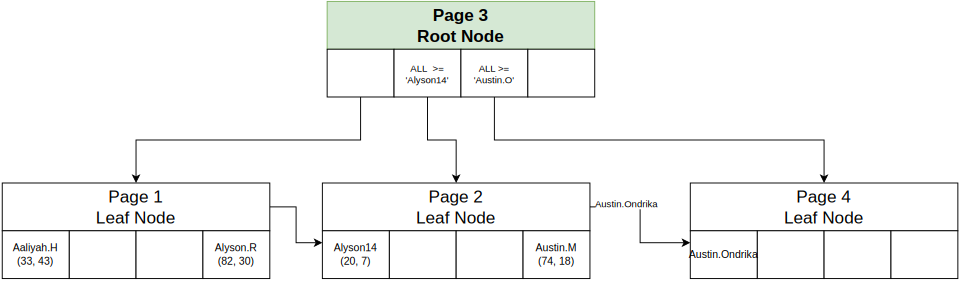
   

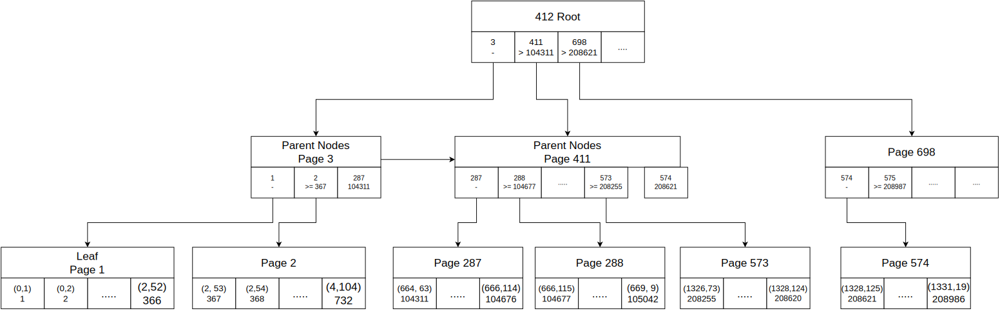
   
