# Section 24: Basic Query Tuning

## Table of Contents

1. [Explain and Explain Analyze](#explain-and-explain-analyze)
1. [Cost](#cost)
1. [Query Under The Hood Steps](#query-under-the-hood-steps)
1. [Indexes vs Full Table Scan](#indexes-vs-full-table-scan)

---

 

## Explain and Explain Analyze

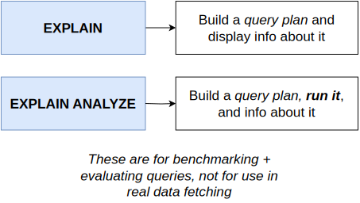
   

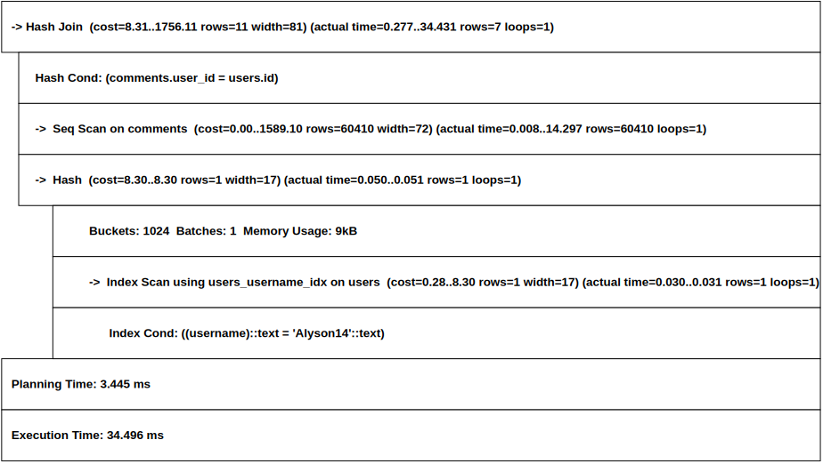
   

   

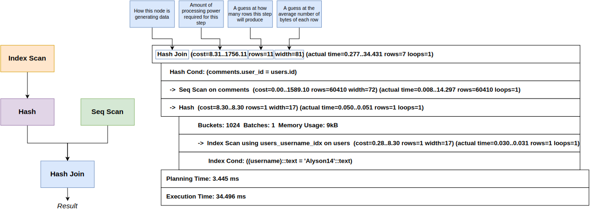
   

## Cost

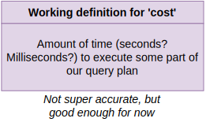
   

# Query Under The Hood Steps

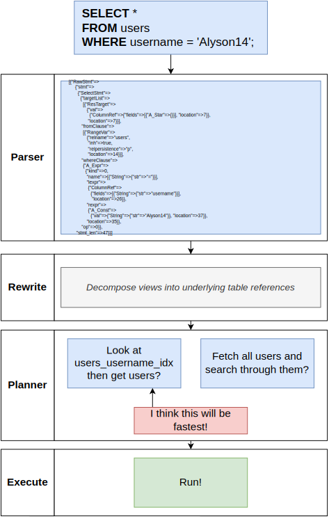
   

## Indexes vs Full Table Scan

   

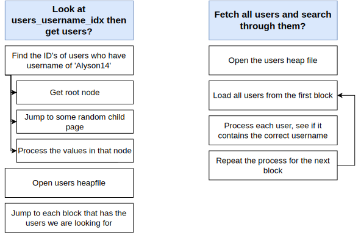
   

   

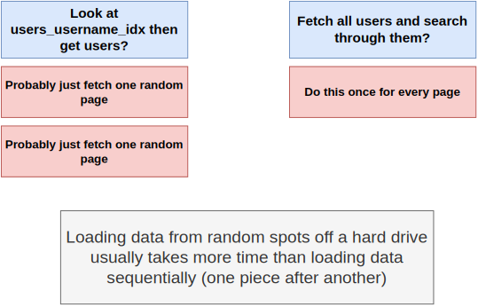
   

   

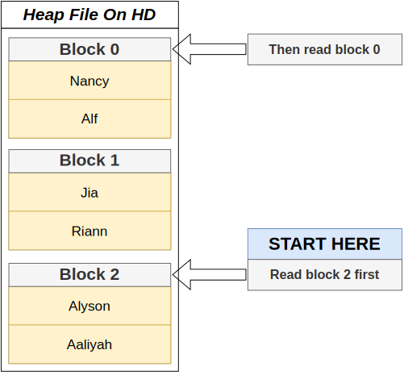
   

   

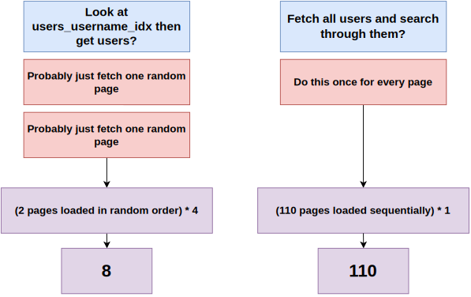
   

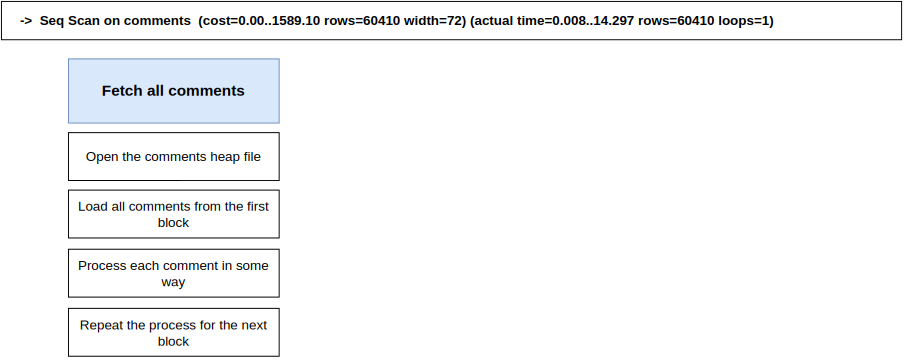
   

   

   

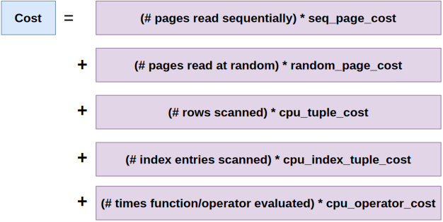
   

   

   

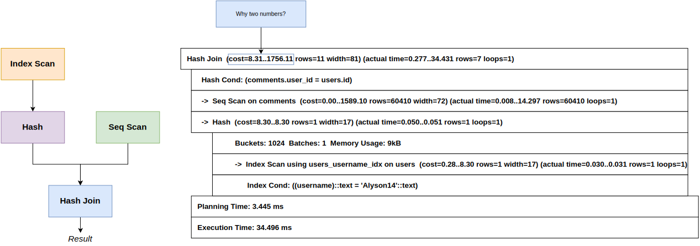
   

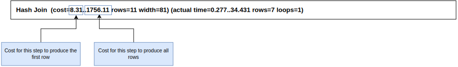
   

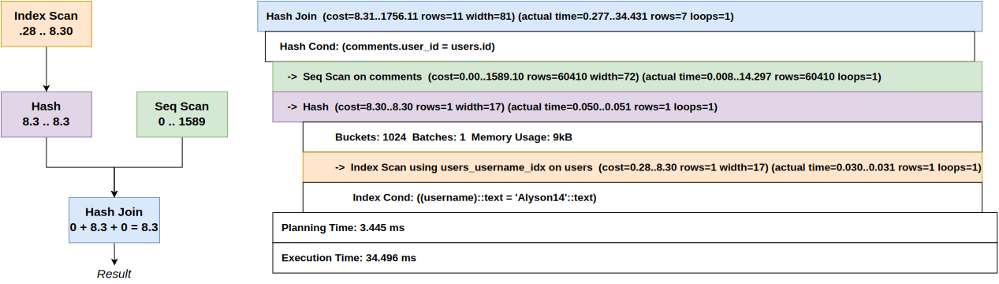
   
