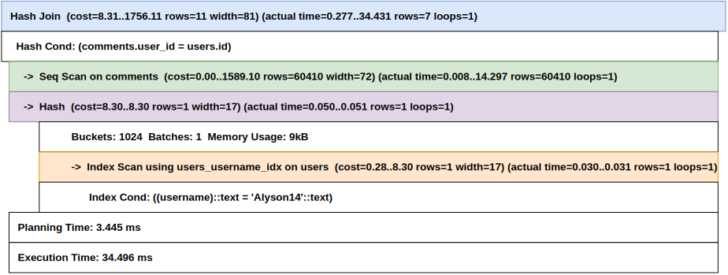
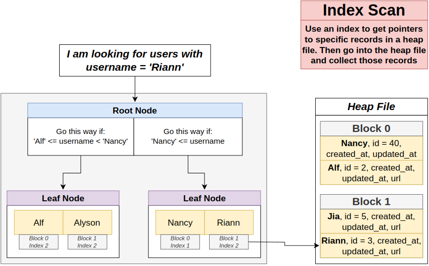
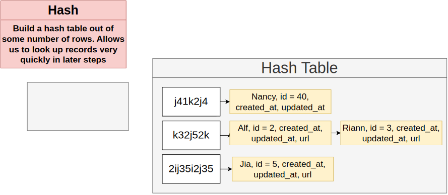
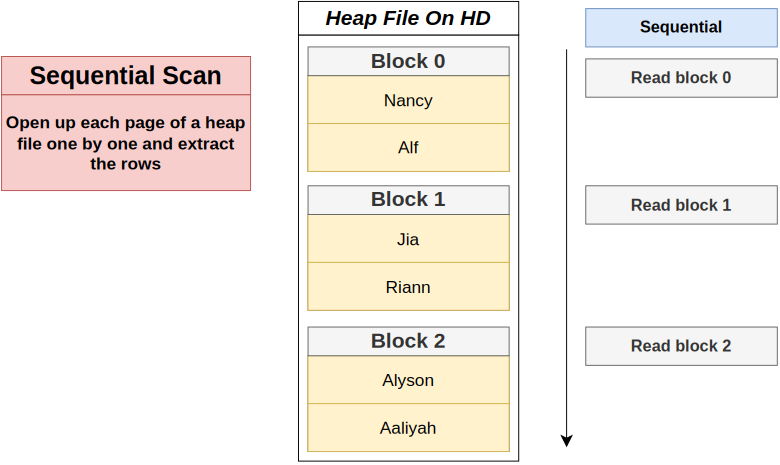
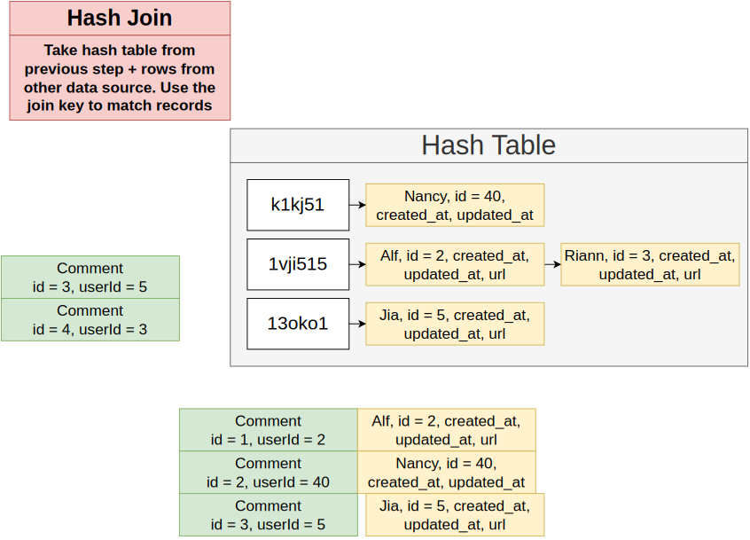
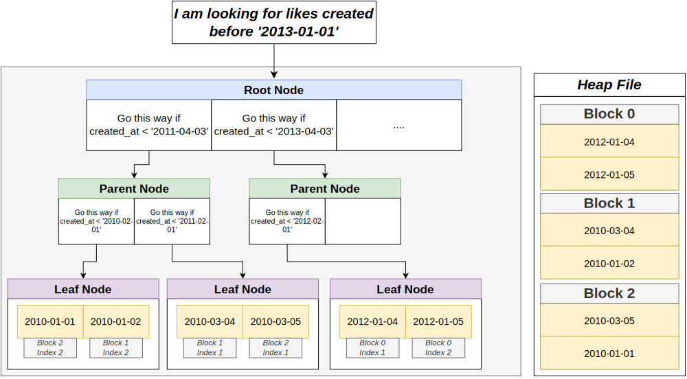

# Section 25: Advanced Query Tuning

## Table of Contents

1. [Index Scan](#index-scan)
1. [Hash](#hash)
1. [Sequential Scan](#sequential-scan)
1. [Hash Join](#hash-join)

---

 

   

## Index Scan

   

## Hash

   

## Sequential Scan

   

## Hash Join

   

   
