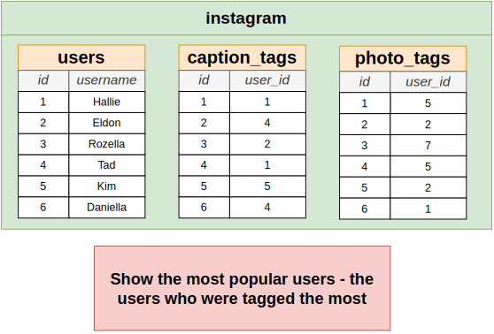
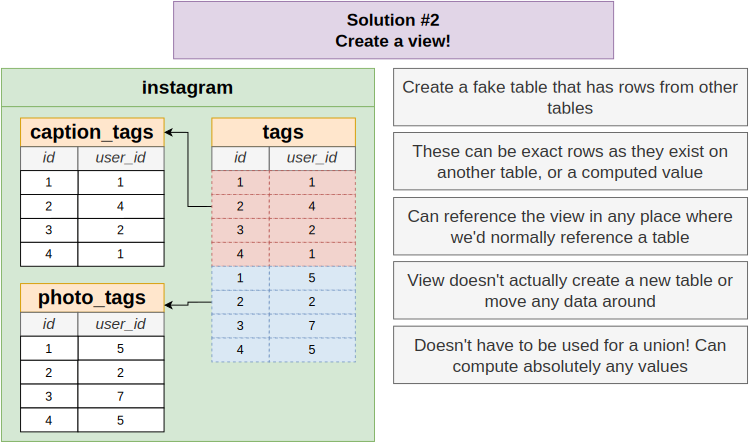
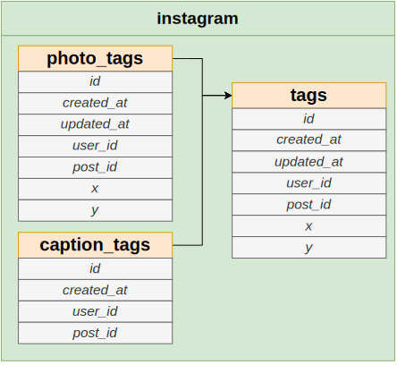
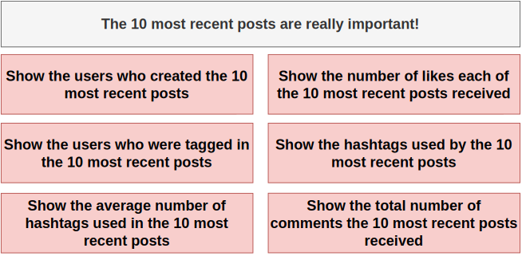

# Section 28: Simplifying Queries with Views

## Table of Contents

1. [Use Case](#use-case)
1. [CTE vs View](#cte-vs-view)
1. [Updatable Views](#updatable-views)
1. [How a View Works](#how-a-view-works)
1. [How a Materialized View Works](#how-a-materialized-view-works)
1. [View vs Materialized View](#view-vs-materialized-view)

---

 

## Use Case

   

   

   

   

   

   

## CTE vs View

   

   

   

   

## Updatable Views

   

## How a View Works

   

## How a Materialized View Works

   

## View vs Materialized View

   
