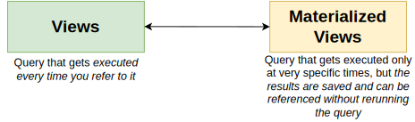
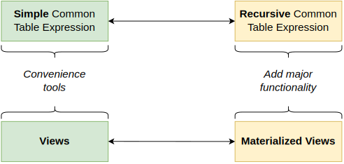
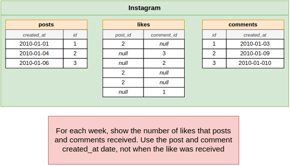
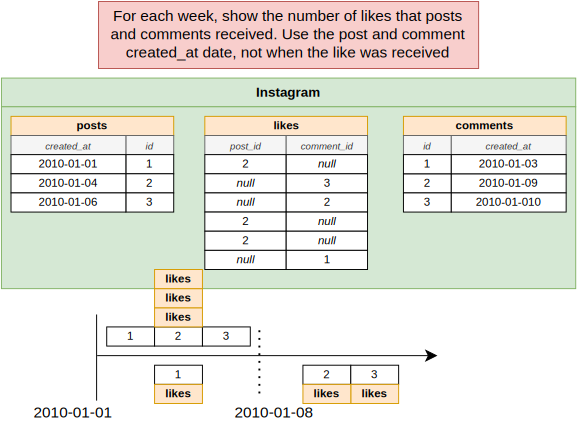
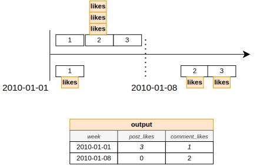
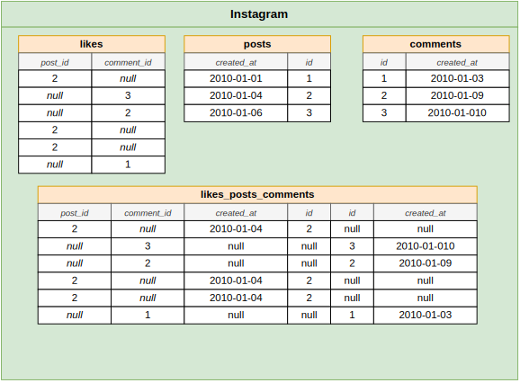

# Section 29: Optimizing Queries with Materialized Views

## Table of Contents

1. [View vs Materialized View](#view-vs-materialized-view)
1. [CTE and Recursive CTE vs Views and Materialized Views](#cte-and-recursive-cte-vs-views-and-materialized-views)

---

 

## View vs Materialized View

   

## CTE and Recursive CTE vs Views and Materialized Views

   

   

   

   

   
