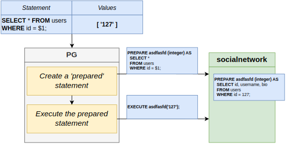

# Section 35: Security Around PostgreSQL

## Table of Contents

1. [SQL Injections](#sql-injections)
1. [Prepared Statements](#prepared-statements)

---

 

## SQL Injections

   

   

   

## Prepared Statements

   

   

   
