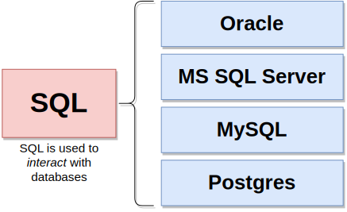

# Test 1 - ul

<ul style="display: flex; flex-direction: column; align-items: center; list-style: none; gap: 24px;">
  <li></li>
  <li></li>
  <li></li>
  <li></li>
  <li></li>
  <li></li>
</ul>

# Test 2 - div text align center

 <ul style="display: flex; flex-direction: column; align-items: center; list-style: none; gap: 24px;">
   <li></li>
   <li></li>
   <li></li>
   <li></li>
   <li></li>
   <li></li>
 </ul>

# Test 3 - text align center

   
   
   
   
   
   

# Test 4 - div display flex

  
  
  
  
  
  

# Test 5 - div display block

  
  
  
  
  
  

# Test 6 - text align center with div align center

   
   
   
   
   
   

# Test 7 - div align center

   
   
   
   
   
   

# Test 7 - div align center

   
   
   
   
   
   

# Test 8 - div 

 <ul style="list-style: none;">
   <li></li>
   <li></li>
   <li></li>
   <li></li>
   <li></li>
   <li></li>
 </ul>

# Test 9 - a lot of div

# Test 10 - display block

